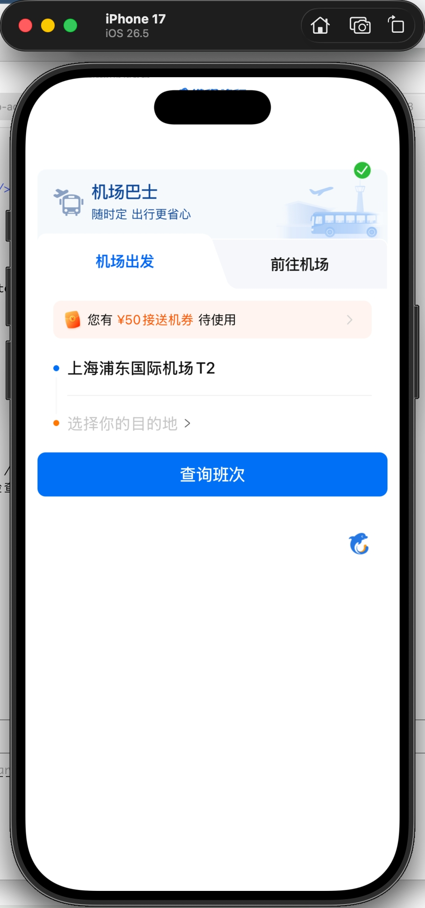
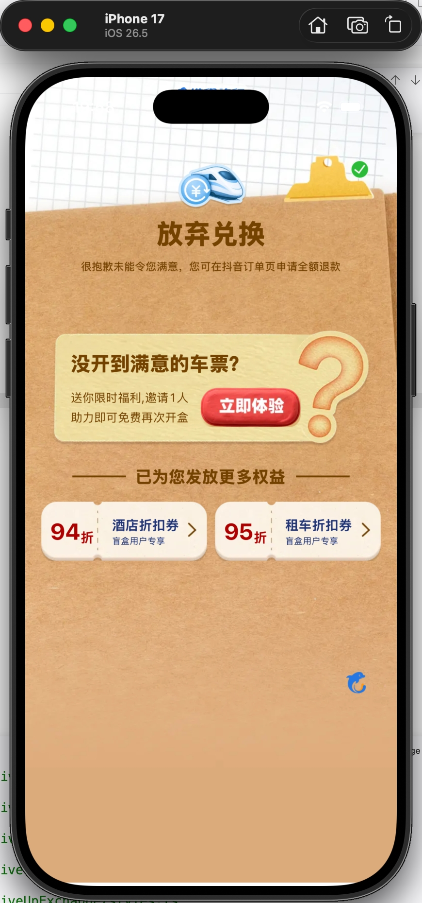
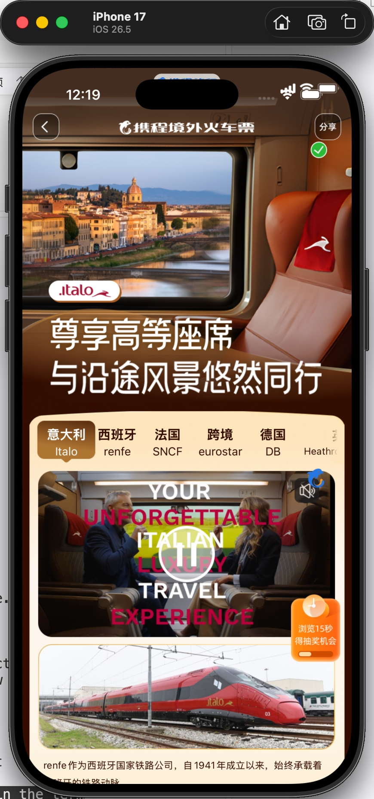
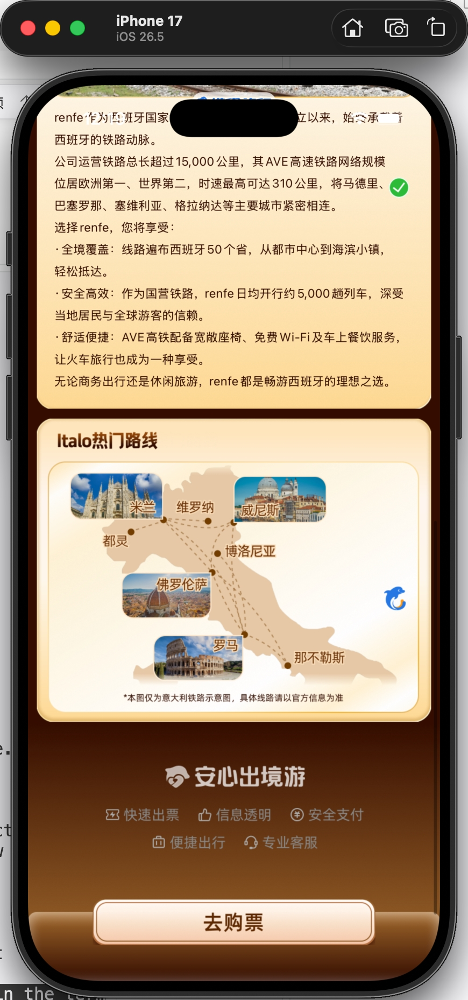
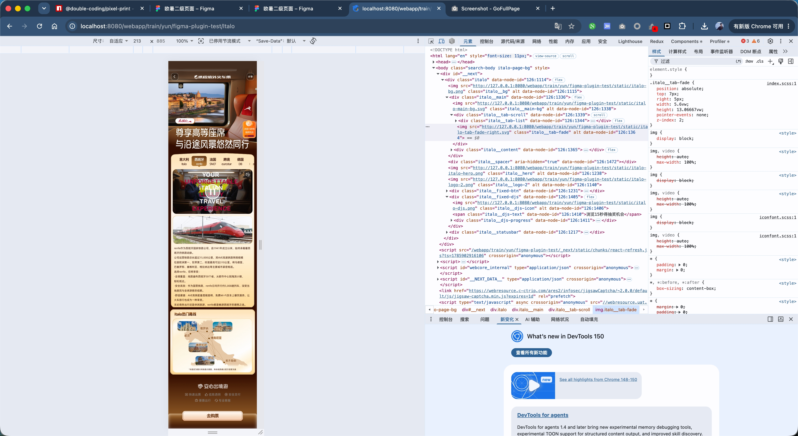

# PixelPrint(像素打印)完整指南

> **PixelPrint / 像素打印** — 寓意「像素级还原」,把 Figma 每一像素、每一间距、每一个圆角原样"打印"成前端代码。
>
> npm 包名:`@double-coding/pixel-print` · GitHub:[double-coding-lab/PixelPrint](https://github.com/double-coding-lab/PixelPrint) · License MIT

---

## 目录

1. [PixelPrint 是什么](#1-pixelprint-是什么)
2. [为什么用它](#2-为什么用它)
3. [覆盖哪些技术栈](#3-覆盖哪些技术栈)
4. [快速上手 3 步](#4-快速上手-3-步)
5. [init 交互实录(3 种典型模式)](#5-init-交互实录3-种典型模式)
6. [CLI 快捷参数速查](#6-cli-快捷参数速查)
7. [装完之后长什么样](#7-装完之后长什么样)
8. [图层命名规范](#8-图层命名规范)
9. [常用能力](#9-常用能力)
10. [`pp-d2c.config.json` 配置字段](#10-pp-d2cconfigjson-配置字段)
11. [Figma Personal Access Token](#11-figma-personal-access-token)
12. [架构与执行模型](#12-架构与执行模型)
13. [故障排查](#13-故障排查)
14. [版本历史](#14-版本历史)
15. [效果图与代码结构](#15-效果图与代码结构)

---

## 1. PixelPrint 是什么

**一套让 Claude Code 学会「把 Figma 稿子还原成代码」的知识包**。

一个 npm 包 + 一套 Claude Code SKILL 组合。跑一行 init,项目根多出:

- `.claude/skills/` 下 3-4 个 SKILL(主流程 + 剥调试属性 + 局部修复)
- `pp-d2c.config.json`(单位换算、图片路径、adapter 等配置)
- `.env`(存 Figma Token)
- rn 项目还多一份 `src/utils/rpx.ts`

然后对 Claude Code 说「把这份稿子转成代码 https://figma.com/design/xxx」,它就开始干活:探活 Token → 跑体检 → 拆图层 → 派 sub-agent 并行出码 → 切图 → 逐块视觉对比 → 交付。

**不是什么**:

- 不是 Figma 插件 — 设计师侧不装东西,全在开发者本地跑
- 不是 Codegen 引擎 — 没有 AST 系统,靠 LLM 按 SKILL 里的自然语言规则出代码
- 不是 MCP 服务器 — v0.3 起用原生 Figma REST API,一枚 Personal Access Token 搞定,不走 OAuth

---

## 2. 为什么用它

**3 个关键能力**:

**图层前缀读意图** — 设计师把图层命名成 `sub-header-nav` / `img-banner` / `fixed-btn-back-top` / `scrollx-cards`,PixelPrint 就知道哪块该拆独立组件、哪块直接切图、哪块要固定定位、哪块要横滑。不用 AI 猜,直接照规范做。

**缓存复用不污染** — 同一份稿子跑第二次:figma 元数据、切好的图、锚点档案全在 `.d2c-cache/`,hash 对比一致就直接复用,10 秒出结果。稿子改过,只 invalidate 变动的那部分,不误伤别的。换稿子(不同 fileKey)完全隔离,不串。

**局部修复不重跑整页** — 页面出完发现某一小块视觉不对,不用整页重来。`pp-fix-partial` 拿 `.d2c-cache/last-page.json` 定位最近实现的稿子,让你选一个子块,只重跑那一块。

**一句话总结**:把 Figma 稿子丢给 Claude,喝杯咖啡的时间拿到可运行的代码 + 视觉对比截图。剩下的时间调业务逻辑,不再抠像素。

---

## 3. 覆盖哪些技术栈

| 端 | 产物 | 目标框架 |
|---|---|---|
| **H5** | React + SCSS/LESS/CSS/Tailwind/Inline | 通用 Web |
| **React Native** | RN + StyleSheet | pure RN / Expo |
| **RN 系跨端** | 同上,但标签自动换 | xtaro / taro,可加自定义预设 |

RN 分支的核心机制是 **adapter**:内核用 6 大 RN 原生标签描述一切(`View / Text / Image / Pressable / TextInput / ScrollView`),`§5.5` 阶段读 config 换标签。这样一套 SKILL 覆盖 pure RN / Expo / xtaro / taro / 自定义。

---

## 4. 快速上手 3 步

**1. 装**

```bash
cd 你的业务项目
npx @double-coding/pixel-print init
```

交互式引导 6 题(RN 分支多 2 道子题),1 分钟内答完。想跳过交互,把选项写在命令行(见 [§6 CLI 快捷参数](#6-cli-快捷参数速查))。

**2. 让设计师按规范命名图层**

把 [`docs/design-guide.md`](./design-guide.md) 发给对接设计师。他花 20 分钟改图层名,你后面省 10 倍时间。

**3. 让 Claude 干活**

```
把这份稿子转成代码:https://figma.com/design/xxx?node-id=1-2
```

---

## 5. init 交互实录(3 种典型模式)

下面三段是 `init` 的真实输出还原(去掉 ANSI 颜色码)。想直接看某一种,跳到:

- [模式 A — H5 交互式](#模式-a--h5-交互式) — 全默认走完
- [模式 B — RN xtaro CLI 一键](#模式-b--rn-xtaro-cli-一键) — 全参数,零交互
- [模式 C — RN custom 交互](#模式-c--rn-custom-交互) — 自定义 tagMap 骨架

### 模式 A — H5 交互式

```
$ npx @double-coding/pixel-print init

─── 阶段一:Figma Token 生成指南 ────────────────────

  v0.3 起完全走 Figma REST API,只需一个 Personal Access Token(阶段三输入):
    1. 打开 https://www.figma.com/ 登录 → 头像 → Settings → Security
    2. Personal access tokens → Generate new token
    3. 权限勾选 "File content: Read-only",复制 token(离开无法再看)

─── 阶段二:交互式配置 ──────────────────────────────

  [1/6] 项目框架 + 方案:
   ● React / SCSS
     React / SCSS Modules
     React / LESS
     React / LESS Modules
     React / CSS
     React / CSS Modules
     React / Tailwind
     React / Inline Style
     RN / pure React Native / Expo
     RN / Taro (@tarojs/components)
     RN / 携程 xtaro
     RN / 自定义标签映射(后续手填)
     RN / 不启用组件映射(保留 RN 原写法)

     ↑↓ / ←→ 移动光标 · 回车确认

  [1/6] 项目框架 + 方案: React / SCSS
  刷新 3 个 skill(pp-d2c / pp-fix-partial / pp-strip-nodeid),共 5 个文件到 .claude/skills/
  [2/6] 样式方案: scss (在 [1/6] 里已选定,不再单独询问)
  [3/6] 合并模式:
   ● flat       单文件合并,所有子 block 展开到主文件(默认)
     component  组件化拆分,每个子 block 独立目录

  [3/6] 合并模式: flat       单文件合并,所有子 block 展开到主文件(默认)
  [4/6] 图片输出目录 [static/]: (回车用默认)
  [5/6] 图片 base URL [http://127.0.0.1:8080/]: (回车用默认)
  [6/6] 代码输出目录 [pages/]: (回车用默认)

─── 阶段三:单位换算规则 ────────────────────────────

  [单位1/4] 设计稿基准宽度 (px) [375]: (回车)
  [单位2/4] 代码使用的单位:
   ● px
     vw
     rem
  [单位2/4] 代码使用的单位: px
  [单位3/4] 代码 px 基准宽度(如 postcss px2vw 基于 750 则填 750) [750]: (回车)
  → 换算倍数:×2(Figma 375px → 代码 750px)
  [单位4/4] Figma Personal Access Token(存到项目根 .env,回车跳过): figd_xxx...
  ✓ 已创建 .env 并写入 FIGMA_TOKEN=<hidden>
  → 创建 .gitignore 并加入 .env

  ✓ pp-d2c.config.json 已写入
  ✓ 单位换算规则已注入 .claude/skills/pp-d2c/SKILL.md

─── 阶段四:追加 .gitignore ─────────────────────────

  append  .gitignore  (+ .d2c-cache/ + .d2c-tmp/)

─── 完成 ────────────────────────────────────────────

  ✓ pp-d2c.config.json    framework=react · merge=flat · unit=px(base 750) · out=pages/
  ✓ .env                  FIGMA_TOKEN 已写入
  ✓ .gitignore            .d2c-cache/ · .d2c-tmp/ · .env

  把设计稿链接发给 Claude 即可开始生成,例:
    把这份设计稿转成代码:https://figma.com/design/xxx?node-id=1-2
```

### 模式 B — RN xtaro CLI 一键

**这一条最推荐给 xtaro / 携程内部项目**。全部参数写在命令行,零交互,10 秒跑完。

```
$ npx @double-coding/pixel-print init \
    --framework rn \
    --adapter-preset xtaro \
    --merge-mode flat \
    --figma-base 375 \
    --responsive on \
    --rpx-helper-import "@ctrip/xtaro" \
    --rpx-helper-name xrpx \
    --assets-dir assets/ \
    --output-dir src/pages/ \
    --figma-token figd_你的token

─── 阶段一:Figma Token ─────────────────────────────

  ✓ 检测到已配置的 FIGMA_TOKEN,阶段三会沿用(如需换 token,重跑并传 --figma-token)

─── 阶段二:交互式配置 ──────────────────────────────

  [1/6] 项目框架 + 方案: RN / 携程 xtaro (命令行参数)
  刷新 3 个 skill(pp-d2c-rn / pp-fix-partial / pp-strip-nodeid),共 5 个文件到 .claude/skills/
  → 已写入 携程 xtaro 预设(6 大 RN 标签映射到 @ctrip/xtaro …)
  [2/6] 是否启用响应式 rpx() 包装(按屏宽线性缩放尺寸): Yes (命令行参数)
  [2.1/6] rpx helper import 路径: @ctrip/xtaro (命令行参数)
  [2.2/6] rpx helper 导出函数名: xrpx (命令行参数)
  [3/6] 合并模式: flat (命令行参数)
  [4/6] 图片输出目录: assets/ (命令行参数)
  [5/6] 图片 base URL: (空) (rn 分支走 require 引用,不用远程 URL)
  [6/6] 代码输出目录: src/pages/ (命令行参数)

─── 阶段三:单位换算规则 ────────────────────────────

  [单位1/2] 设计稿基准宽度 (px): 375 (命令行参数)
  [单位2/2] 换算: RN 数字模式(scale=1, figmaBase=375 pt) (rn 分支固定,不做单位选择)
  [单位2/2] Figma Personal Access Token(存到项目根 .env,回车跳过): figd_xxx... (命令行参数)
  ✓ 已创建 .env 并写入 FIGMA_TOKEN=<hidden>
  → 创建 .gitignore 并加入 .env

  ✓ pp-d2c.config.json 已写入
  info  helperImport "@ctrip/xtaro" 看起来是外部包,SKILL 会按此路径引用,不落地本地 helper 文件
  ✓ 单位换算规则已注入 .claude/skills/pp-d2c-rn/SKILL.md

─── 阶段四:追加 .gitignore ─────────────────────────

  append  .gitignore  (+ .d2c-cache/ + .d2c-tmp/)

─── 完成 ────────────────────────────────────────────

  ✓ pp-d2c.config.json    framework=rn · merge=flat · unit=px(base 375) · out=src/pages/
  ✓ adapter               携程 xtaro
  ✓ 响应式 rpx()          @ctrip/xtaro · xrpx()
  ✓ .env                  FIGMA_TOKEN 已写入
  ✓ .gitignore            .d2c-cache/ · .d2c-tmp/ · .env

  把设计稿链接发给 Claude 即可开始生成,例:
    把这份设计稿转成代码:https://figma.com/design/xxx?node-id=1-2
```

### 模式 C — RN custom 交互

用于**自研 UI 库 / 非内置预设**。选完 custom,`init` 会在 config 里生成一份 6 键空 `tagMap` 骨架,让你后续手填目标标签。

```
$ npx @double-coding/pixel-print init --framework rn --adapter-preset custom

  [1/6] 项目框架 + 方案: RN / 自定义标签映射(后续手填) (命令行参数)
  刷新 3 个 skill(pp-d2c-rn / pp-fix-partial / pp-strip-nodeid),共 5 个文件到 .claude/skills/
  → adapter.enabled=true,已生成 6 键空 tagMap 骨架,请在 pp-d2c.config.json 里填入目标标签 / importMap / propMap
  [2/6] 是否启用响应式 rpx() 包装(按屏宽线性缩放尺寸):
   ● Yes
     No
  [3/6] 合并模式:
   ● flat       单文件合并,所有子 block 展开到主文件(默认)
     component  组件化拆分,每个子 block 独立目录
  ...

─── 完成 ────────────────────────────────────────────

  ✓ pp-d2c.config.json    framework=rn · merge=flat · unit=px(base 375) · out=src/pages/
  ✓ adapter               自定义(config.adapter.tagMap 6 键待填)
  ...
```

装完打开 `pp-d2c.config.json`,把 6 个空字符串填成你的组件名:

```jsonc
"adapter": {
  "enabled": true,
  "tagMap": {
    "View":       "",   ← 填成你的容器组件名,例如 "MyView"
    "Text":       "",   ← 例如 "MyText"
    "Image":      "",
    "Pressable":  "",
    "TextInput":  "",
    "ScrollView": ""
  },
  "importMap": {         ← 每个组件的 import 源
    "MyView": "@my-org/ui"
  },
  "propMap": {           ← 需要重命名的 prop(不写就沿用 RN 原名)
    "Image": { "source": "src" }
  },
  "reactImport": "react"
}
```

---

## 6. CLI 快捷参数速查

**优先级**:CLI > 现有 config > 默认值 / 交互输入。

未传的项照常走交互;CLI 命中的项会显示 `(命令行参数)`,现有 config 命中的显示 `(沿用现有配置)`。

**写法**:`--key value` 与 `--key=value` 都接受。未知参数静默忽略。

| 参数 | 值 | 适用 |
|---|---|---|
| `--framework` | `react` \| `rn` | 全部 |
| `--style-format` | `scss` \| `scss-modules` \| `less` \| `less-modules` \| `css` \| `css-modules` \| `tailwind` \| `inline` | 仅 react |
| `--adapter-preset` | `rn` \| `taro` \| `xtaro` \| `custom` \| `off` | 仅 rn |
| `--merge-mode` | `flat`(默认) \| `component` | 全部 |
| `--figma-token` | `figd_...` | 全部(写入 `.env`) |
| `--figma-base` | 数字,如 `375` | 全部 |
| `--output-unit` | `px` \| `vw` \| `rem` | 仅 react |
| `--output-base` | 数字,如 `750` | 仅 react |
| `--responsive` | `on` \| `off` | 仅 rn |
| `--assets-dir` | 目录,如 `assets/` | 全部 |
| `--image-base-url` | URL | 仅 react |
| `--output-dir` | 目录,如 `src/pages/` | 全部 |
| `--rpx-helper-import` | 路径,如 `@/utils/rpx` 或包名 | 仅 rn + responsive |
| `--rpx-helper-name` | 函数名,如 `rpx` / `xrpx` | 仅 rn + responsive |

---

## 7. 装完之后长什么样

**SKILL**(`.claude/skills/`,按 framework 分):

| SKILL | 作用 | 何时落地 |
|---|---|---|
| `pp-d2c/` | H5 主 D2C 流程 | framework=react 时 |
| `pp-d2c-rn/` | RN 主 D2C 流程(6 大 RN 内核标签 + adapter) | framework=rn 时 |
| `pp-strip-nodeid/` | 剥离 `data-node-id` 调试属性 + 生成 anchor 档案 | 总是装 |
| `pp-fix-partial/` | 局部 UI 修复(v1.1.0+) | 总是装 |
| `pp-doctor/` `pp-style/` | 体检 / 样式速查 | opt-in(需手工 cp 过来) |

**配置与资产**:

- `pp-d2c.config.json` — 项目配置(前缀映射 / 单位换算 / 图片路径 / 体检阈值 / adapter);**已默认 gitignore**
- `.env` — 存 `FIGMA_TOKEN`;**已默认 gitignore**
- `.d2c-cache/` — 跨会话缓存(figma JSON / 切图 / anchor / last-page.json);**已默认 gitignore**
- (RN 分支 + responsive + 相对路径 helperImport)`src/utils/rpx.ts` — 响应式尺寸 helper(helperImport 是外部包时不落地文件)

---

## 8. 图层命名规范

完整规范:[`design-guide.md`](./design-guide.md)。速查表:

| 前缀 | 含义 | 生成效果 |
|------|------|---------|
| `sub-` | 独立模块 | 单独 sub-agent,生成独立组件;支持嵌套(最深 3 层) |
| `block-` | 独立布局块 | HTML/CSS 隔离容器,不可点击 |
| `img-` | 整块图片 | 整层导出为 PNG,不递归子孙 |
| `bg-` | 背景图 | 写父元素 `background-image`,不递归子孙 |
| `bgc-` | 盒级装饰 | 写父元素 fills / strokes / cornerRadius / effects,不递归 |
| `btn-` | 可点击 | H5:`<button>`;RN:`<Pressable>` |
| `input-` | 输入框 | 生成 `<input>` / `<TextInput>`,子 TEXT 变 placeholder |
| `scrollx-` / `scrolly-` | 横向 / 纵向滚动 | overflow + 隐藏滚动条,**继续递归子层** |
| `fixed-` | 视口固定 | `position: fixed`,读 Figma constraints |
| `end-` | 贴父末端 | auto-layout 里贴向末端(纵→贴底 / 横→贴右) |
| `x-` | 忽略 | 不生成代码 |

**修饰前缀可叠加**(选例):`fixed-btn-back-top` / `sub-scrollx-cards` / `end-btn-submit` / `fixed-sub-nav`。

**禁止叠加**:

- `scrollx-` / `scrolly-` × `img-` / `bg-` / `bgc-` / `btn-` / `x-`(语义冲突)
- `fixed-` × `bg-` / `bgc-` / `x-`(bg/bgc 不生成节点,fixed 无处可挂)
- `input-` × `bg-` / `bgc-` / `x-` / `img-` / `btn-`

---

## 9. 常用能力

### 局部 UI 修复(v1.1.0)

页面已经出码,某一小块视觉不对,不用整页重跑。让 Claude 走 `pp-fix-partial`:

```
# 3 种触发形态
pp-fix-partial https://figma.com/design/AAA?node-id=138-2050   # 明确 URL
pp-fix-partial                                                  # 不传参:拿最近实现的整页,让你选一个子块
pp-fix-partial 顶部导航栏                                        # 自然语言 fuzzy match
```

**利用缓存不污染**:

- hash 对比 target 子树 → 变了才 invalidate 该 nodeId 的缓存
- 图片文件名带 fileKey 前缀 → 换稿子天然隔离
- 缓存 mtime 超 7 天自动 TTL 作废

### 剥调试属性 + 存锚点

上线前跑一次,把 `data-node-id="..."` 从产物剥掉,顺手把 nodeId → (file, startLine, endLine) 存到 `.d2c-cache/anchors/`,供后续 `pp-fix-partial` 精确定位:

```bash
node .claude/skills/pp-strip-nodeid/strip-node-id.mjs --dry-run   # 先预览
node .claude/skills/pp-strip-nodeid/strip-node-id.mjs             # 确认后清理
```

加 `--no-anchors` 关掉锚点写入(如果只是纯剥,不打算用局部修复)。

### 设计稿体检(Doctor)

H5 分支 `health.enabled: true` 时(默认),主 SKILL 生成代码前会跑一次体检:

- **NAM** 命名规范 · **LAY** 布局合理 · **STR** 嵌套深度 · **STY** 颜色/字号 · **AST** 资产体积 · **FEA** 整体规模
- 输出 grade(A/B/C/D/F)+ 阻塞决策;`grade=F && blockOnError=true` 会停下来等确认
- 报告落到 `{output.dir}/.d2c-health-{nodeName}-{timestamp}.md`

**RN 分支不默认接 doctor**(规则以 H5 语义为主,RN 语境会假阳)。

### RN Adapter(v0.4+)

RN 分支的核心机制:**内核用 6 大 RN 原生标签描述一切**(`View / Text / Image / Pressable / TextInput / ScrollView`),`§5.5` 阶段读 config 换标签。

内置 3 个预设:

| 预设 | 目标 | 映射示意 |
|---|---|---|
| `rn` | pure RN / Expo | 保留原名(identity),`from 'react-native'` |
| `xtaro` | 携程 `@ctrip/xtaro` | `View→XView / TextInput→XInput / ScrollView→XScrollView`,`from '@ctrip/xtaro'` |
| `taro` | Taro `@tarojs/components` | `TextInput→Input / Pressable→View`,`from '@tarojs/components'` |

每个预设 3 件套:`<id>.json`(映射规则)+ `<id>.rpx.ts`(专属屏宽 helper)+ `<id>.reference.md`(超改名的复杂差异手册)。

**加持久化预设**:见 [`templates/adapter-presets/README.md`](../templates/adapter-presets/README.md)。

---

## 10. `pp-d2c.config.json` 配置字段

字段完整说明见主 SKILL `templates/skills/pp-d2c/SKILL.md` §0 或 `pp-d2c-rn/SKILL.md` §0。**核心字段**:

```jsonc
{
  "project": {
    "framework": "react",     // react | rn
    "styleFormat": "scss"     // h5: scss / scss-modules / less / less-modules / css / css-modules / tailwind / inline
                              // rn: 固定 stylesheet
  },
  "merge": { "mode": "flat" },        // flat(默认,单文件合并) | component(组件化拆分)
  "unit": {
    "figmaBase": 375,         // 设计稿基准宽度
    "outputUnit": "px",       // h5: px | vw | rem;rn 无单位字符串
    "outputBase": 750,        // h5 默认 2 倍图;rn 固定 = figmaBase
    "scale": 2                // h5 默认 2;rn 固定 1
  },
  "images": {
    "assetsDir": "static/",   // rn 默认 "assets/"
    "imageBaseUrl": "http://127.0.0.1:8080/",  // rn 走 require 不用 URL
    "preserveEffectIds": []
  },
  "layers": { /* 12 类前缀映射,生产建议保持默认 */ },
  "output": { "dir": "pages/" },      // rn 默认 "src/pages/"
  "health": { "enabled": true, "blockOnError": true, /* ... */ }
}
```

**RN 分支额外字段** `adapter` + `unit.responsive`:

```jsonc
{
  "unit": {
    "responsive": {
      "enabled": true,
      "helperImport": "@/utils/rpx",   // 相对/绝对 → 落地本地 helper 文件;外部包名 → 不落地
      "helperName": "rpx"
    }
  },
  "adapter": {
    "enabled": true,
    "tagMap": { "View": "XView", "...": "..." },
    "importMap": { "XView": "@ctrip/xtaro", "...": "..." },
    "propMap": { "Image": { "source": "src" } },
    "referenceDoc": "xtaro.reference.md"
  }
}
```

> **Token 不入 config**:v1.0.2 起 Figma Token 走 `.env` `FIGMA_TOKEN=...`,`pp-d2c.config.json` 不再存 token 字段。

---

## 11. Figma Personal Access Token

SKILL 通过 Figma REST API 拉稿子 + 导图,只需要一枚 Personal Access Token。**不需要装任何 MCP 插件、不走 OAuth**。

**获取步骤**:

1. 打开 [figma.com](https://figma.com) 登录,右上头像 → **Settings**
2. 左侧 **Security** → **Personal access tokens** → **Generate new token**
3. 名称随意(如 `pp-d2c`),**Scopes** 至少勾 `File content: Read-only`
4. 复制 token(格式 `figd_xxx...`),不要关窗口(离开无法再看)
5. 三种落地方式任选:
   - `init` 时粘贴到 Token 那题
   - 命令行 `init --figma-token figd_xxx`
   - 手动写到项目根 `.env` 的 `FIGMA_TOKEN=...`

**探针验证**:Claude 跑 SKILL 步骤 -1 会调 `figma.mjs verify-token`:

| 结果 | 含义 | 处理 |
|---|---|---|
| 200 | Token 有效 | 继续 |
| 401 | Token 已过期/拼错 | 重新生成 |
| 403 | Scope 不够 | 重新生成时勾 `File content: Read-only` |
| 网络错误 | 网络不通 api.figma.com | 排查代理/防火墙 |

> **安全**:`.env` 默认 gitignore。请勿把 token 写进任何 committed 文件。

---

## 12. 架构与执行模型

### 一句话定位

**PixelPrint 是一套让 Claude Code 学会「按项目规范把 Figma 稿子还原成代码」的知识包**。

它把三样东西打包给 Claude Code:

1. **SKILL.md** — 自然语言写的操作手册,教 LLM 每一步该干什么
2. **bin/figma.mjs** — 把机械动作(HTTP 请求、缓存、图片下载)固化下来,LLM 通过 Bash 调用
3. **图层命名规范** — 给设计师看的合约,让 LLM 能理解意图

### 3 层责任分工

| 层 | 角色 | 承载 | 谁写 |
|---|------|------|------|
| **数据层** | `figma.mjs` | HTTP、缓存、图片下载、图片元数据(bbox / lastModified) | 开发者(命令式代码) |
| **规则层** | `SKILL.md` | 图层前缀语义、单位换算、图片处理规则、adapter 应用步骤、视觉验收 | 开发者(自然语言) |
| **执行层** | Claude Code | 读 SKILL → 调 figma.mjs → 出 JSX → 自检 → 视觉对比 | LLM |

**关键契约**:

- 数据层的输入输出必须是 JSON(`figma.mjs` stdout 一行 `{ok: true, data: ...}` 或 `{ok: false, error: ...}`),LLM 拿到能直接解析
- 规则层不做任何计算,只描述规则、给例子、列禁止项
- 执行层没有代码可执行,靠 LLM 遵守规则层

### 出码流程 7 大步骤

```
用户: 把这份稿子转成代码 https://figma.com/design/AAA?node-id=138-1797

Claude Code(读 pp-d2c/SKILL.md):
  步骤 -1: node figma.mjs verify-token        → 200 OK
  步骤 0.3: node figma.mjs cache-check AAA    → { fresh: true, lastModified: ... }
  步骤 2.5: node figma.mjs fetch-node AAA 138:1797 --depth=full
    ↓ (拿到整棵子树 JSON)
  按前缀切分 sub-block:sub-header / sub-banner / sub-cards ...
  步骤 3: 派发 3 个 sub-agent,每个处理一个 sub-block
    ↓ 每个 sub-agent:
    - fetch-node 拿子块细节
    - 按前缀规则出 JSX + 样式
    - 遇到 img-/bg-:export-image 落到 assets/,URL 拼进 JSX
    - 独立视觉验收
  步骤 5: 主 agent 合并 sub-block(component / flat 模式二选一)
  步骤 6.0: 逐叶子 sub-block 单独视觉对比(禁止用整体大图代替)
  步骤 6.3: 写 .d2c-cache/last-page.json
  步骤 7: 输出交付物清单(含"上线前跑 pp-strip-nodeid")
```

### 缓存分层与防污染

```
.d2c-cache/
├── figma/<fileKey>-<nodeId>.json      # 节点子树 JSON + hash + mtime
├── images/<fileKey>-<nodeId>-<idx>.png # 切图缓存
├── anchors/<pageDirSlug>.json          # 由 pp-strip-nodeid 生成
├── last-page.json                       # 主 SKILL 写,pp-fix-partial 读
└── <fileKey>/{meta.json, bbox/*.json}
```

**4 条防污染硬规则**:

1. 所有缓存路径必带 `<fileKey>` 前缀 → 换稿子天然隔离
2. 每次覆写不追加 → cache 是"当前真相"快照
3. 单一写入源 → `last-page.json` 只主 SKILL 写,`anchors/` 只 `pp-strip-nodeid` 写,`pp-fix-partial` 只读
4. hash 对比 + mtime TTL 双保险(7 天没跑就当过期)

### 关键设计:SKILL 是 LLM 操作手册,不是可执行代码

SKILL.md 里所有类似 `doctor.run({...})` / `partial.replace(file, str)` 的写法都是**给 LLM 的操作描述**,不是可运行 API。LLM 读到会理解为"我需要用 Bash 调 xxx",而不会期望有 `readDesignContext()` 这个函数存在。

**为什么**:

- 传统 Codegen 用 AST 需要覆盖所有 Figma 节点类型 × 所有目标框架,组合爆炸维护成本极高
- LLM 天生能理解"规则 + 例子",让它自己看设计稿产 JSX 是更少代码路径的实现
- SKILL 演化只需改 md 文件,不用重构引擎

**代价**:依赖 LLM 遵守指令(所以 SKILL 里大量"禁止"条款 + 强制自检 4 行)。

---

## 13. 故障排查

| 现象 | 入口 |
|------|------|
| 切出来的图带画板背景色 / 光晕外扩 | `/v1/images` 必须带 `use_absolute_bounds=true`(主 SKILL §4.4) |
| `card-bg.png` 把 `bg-bg` + `bgc-选中框` 揉成一张 | bgc- 嵌在 bg- 子树是错误结构(doctor NAM013) |
| `bg-list.png` 把列表项内容印进背景 | `sub-scrolly-` 必须递归子层不能整体导出(主 SKILL §4.4 自检 4 行) |
| Figma token 过期 / 失败 | 走 verify-token 探针;失败终止,用户重生 token 后重跑 |
| `position: fixed` 元素跟着祖先滚动 | 祖先链有 `transform` / `filter` / `blur`(doctor LAY013) |
| RN 产物尺寸 ×2 视觉偏大 | 早期 h5 残留;v1.0.0 起 rn 硬编码 `scale=1` |
| `doctor.run()` 函数找不到 | SKILL.md 是 LLM 操作手册,不是可执行代码(见 §12) |
| 局部修复找不到 target | 先确认 `.d2c-cache/last-page.json` 存在;不存在说明还没跑过整页主 SKILL |
| 自定义 adapter 生成后不生效 | `pp-d2c.config.json` 里 `adapter.tagMap` 6 键是否都填了目标标签(空字符串会被 SKILL 视为未配置) |
| 缓存出问题 / 想重来 | `npx @double-coding/pixel-print clean-cache` |

---

## 14. 版本历史

| 版本 | 里程碑 |
|---|---|
| **v1.1.1** | **新增 14 个 CLI 快捷参数(`--framework / --adapter-preset / --merge-mode / ...`,CLI > config > 交互);merge.mode 默认改成 flat;custom adapter 生成 6 键空 tagMap 骨架;移除 code-connect 复制;输出精简(阶段数从 5 收成 4)** |
| v1.1.0 | 新增 `pp-fix-partial` 局部修复 skill + `.d2c-cache/last-page.json` + `pp-strip-nodeid` 存 anchor 档案 + `clean-cache` 命令 + init [1/N] 平铺一层 |
| v1.0.3 | RN 页面根强制 ScrollView 骨架 + fixed 分层贴屏 + bg- 铺满用 Figma 事实尺寸 |
| v1.0.2 | Token 迁到 `.env`;`sub-` FIXED 高度 → `min-height` 防塌陷;冗余嵌套 autoLayout 属性向内层下穿 |
| **v1.0.0** | **首个稳定版**;GitHub 上线 `double-coding-lab/PixelPrint`;`font-` 前缀移除 |
| v0.4.0 | rebrand 到 `@double-coding/pixel-print`;RN 分支独立 + adapter 机制 + rpx 响应式包装 + reference.md 手册机制 |
| v0.3.x | Figma MCP → REST API 迁移(figma.mjs);token 探针取代 whoami;新增 `end-` / `input-` 前缀;页面根 `min-height: max(..., 100vh)` |
| v0.2.x | 图层前缀体系泛化、doctor 体检、token 兜底链、嵌套 sub-、bgc- 盒级 CSS、CSS-able 自检、`fixed-` 前缀 |

---

## 15. 效果图与代码结构

以下是 PixelPrint 在真实业务里跑出来的两个页面产物,均由 `pp-d2c-rn` skill 一次生成(xtaro adapter + `rpx()` 响应式包装)。

### 15.1 案例一:机场巴士(AirportBus)

**场景**:接送机业务落地页,含标签切换、优惠券、地址选择、CTA 按钮。

<p align="center">
  
</p>

**生成的目录结构**(节选自 xtaro 项目 `src/pages/AirportBus/`):

```
AirportBus/
├── index.tsx           ← 页面主入口,含 data-node-id 调试属性,便于回溯 Figma
├── styles.ts           ← StyleSheet.create + rpx() 响应式包装
└── .d2c-tasks.md       ← 该次执行的验收清单(每项 sub-agent 都要 [x] 才算完成)
```

**核心代码**(`index.tsx` 节选,完整代码见 [`docs/samples/AirportBus/`](./samples/AirportBus/)):

```tsx
import { XImage, XText, XView } from '@ctrip/xtaro'
import { styles } from './styles'

export default function AirportBus() {
  return (
    <XView style={styles.root} data-node-id="1:1459">
      <XImage style={styles.bgTitle} src={require('@Images/AirportBus/title.png')} data-node-id="1:1460" />
      <XImage style={styles.tabs} src={require('@Images/AirportBus/tabs.png')} data-node-id="1:1647" />

      <XView style={styles.card} data-node-id="1:1623">
        {/* 优惠券条 */}
        <XView style={styles.coupon} data-node-id="1:1637">
          <XView style={styles.couponMain} data-node-id="1:1639">
            <XImage style={styles.couponIcon} src={require('@Images/AirportBus/hongbao.png')} data-node-id="1:1644" />
            <XView style={styles.couponTextRow} data-node-id="1:1640">
              <XText style={styles.couponPrefix} data-node-id="1:1641">您有</XText>
              <XText style={styles.couponMoney} data-node-id="1:1642">¥50接送机券</XText>
              <XText style={styles.couponSuffix} data-node-id="1:1643">待使用</XText>
            </XView>
          </XView>
          <XImage style={styles.couponArrow} src={require('@Images/AirportBus/arrow-coupon.png')} data-node-id="2:330" />
        </XView>

        {/* 出发→目的地 */}
        <XView style={styles.tripRow} data-node-id="6:330"> ... </XView>

        {/* 查询按钮 */}
        <XView style={styles.btnQuery} data-node-id="6:333">
          <XText style={styles.btnQueryText}>查询班次</XText>
        </XView>
      </XView>
    </XView>
  )
}
```

**关键观察**:

- 6 大 RN 内核标签(`XView / XText / XImage / ...`)全部走 `@ctrip/xtaro` 导入,一次到位
- `data-node-id="1:1459"` 反向映射 Figma 节点,`pp-fix-partial` 局部修复靠这个精确定位
- 尺寸全部 `rpx(...)` 包装,自动按屏宽线性缩放
- 图片路径统一 `require('@Images/...')` 别名,不走远程 URL

### 15.2 案例二:放弃兑换页(GiveUpExchange)

**场景**:兑奖失败挽留页,含全屏渐变背景、绝对定位卡片、横向 scroll 券卡列表、分页点。

<p align="center">
  
</p>

**这个案例展示的 PixelPrint 能力**:

- **图片型背景**:`bg-pic1` 全屏渐变直接切图落到 CDN,不递归子孙
- **绝对定位卡片**:Figma `layoutPositioning=ABSOLUTE` 精确翻译成 `position: 'absolute'` + top/left
- **横向滚动列表**:`scrollx-` 前缀自动生成 `<XScrollView horizontal>` + `contentContainerStyle`
- **分页指示器**:小圆点由 Figma 的 fills + cornerRadius 直接推 CSS,不切图

核心代码见 [`docs/samples/GiveUpExchange/`](./samples/GiveUpExchange/)。片段:

```tsx
<XScrollView
  horizontal
  showsHorizontalScrollIndicator={false}
  style={styles.ticketScroll}
  contentContainerStyle={styles.ticketScrollContent}
  data-node-id="192:773"
>
  <XView style={styles.ticket} data-node-id="192:774">
    <XImage style={styles.ticketBg} src="..." data-node-id="192:775" />
    <XView style={styles.ticketContent} data-node-id="192:782">
      <XView style={styles.ticketPriceRow}>
        <XText style={styles.ticketPriceNum}>94</XText>
        <XText style={styles.ticketPriceUnit}>折</XText>
      </XView>
      ...
    </XView>
  </XView>
  <XView style={styles.ticket} data-node-id="192:789"> ... </XView>
</XScrollView>
```

### 15.3 案例三:境外火车票落地页(Italo H5)

**场景**:同一套 skill 走 H5 分支(React + SCSS)产出的复杂长图运营页,含全屏背景图、tab 切换、视频、地图路线、CTA。

<table>
  <tr>
    <td width="50%" align="center">
      
      <br/><sub>顶部:tab + 视频 + 主标题</sub>
    </td>
    <td width="50%" align="center">
      
      <br/><sub>中部:热门路线地图 + CTA</sub>
    </td>
  </tr>
</table>

**data-node-id 反查设计稿**(DevTools 元素审查):

<p align="center">
  
</p>

上图截自浏览器 DevTools 元素面板。每个 DOM 节点都带 `data-node-id="126:1114"` 之类的属性,可直接拿回 Figma 定位到对应图层。**上线前**跑一次 `pp-strip-nodeid` 剥掉这些属性 + 落地 anchor 档案(供后续 `pp-fix-partial` 精确定位),生产 bundle 里不会有额外体积。

### 15.4 生成产物的目录组织

`pp-d2c-rn` / `pp-d2c` 两个 skill 出的产物结构一致:

```
{output.dir}/{PageName}/
├── index.tsx           ← 页面主入口,含 data-node-id
├── styles.ts           ← flat 模式下所有子 block 样式聚合在一个 StyleSheet
├── styles/             ← component 模式才有,子 block 拆到独立目录
│   └── {subBlock}/
│       ├── index.tsx
│       └── styles.ts
├── .d2c-tasks.md       ← 本次执行的验收清单(所有 sub-agent 都要 [x])
└── .d2c-health-{...}   ← H5 分支体检报告(可关)
```

配套图片资产落到 config 声明的 `images.assetsDir`(RN 默认 `assets/`,H5 默认 `static/`),路径不干涉业务已有目录。

---

## License

MIT © double-coding-lab
