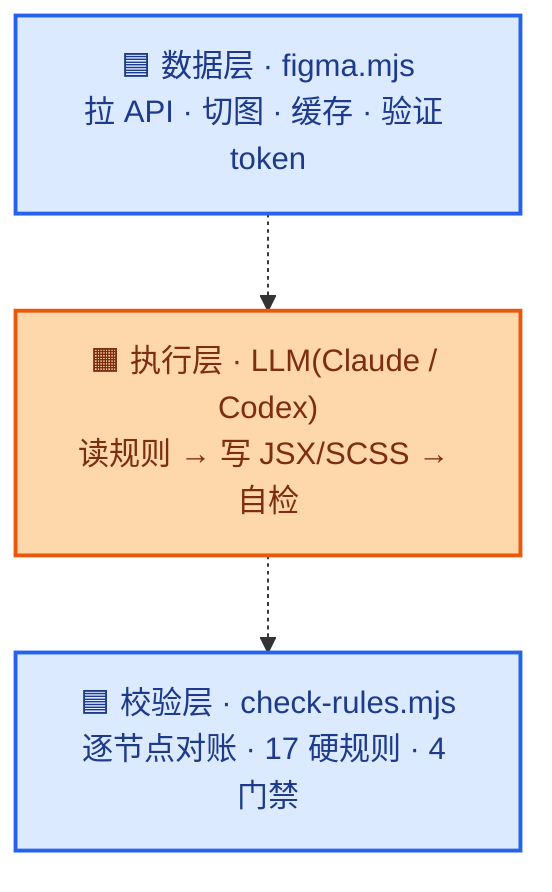
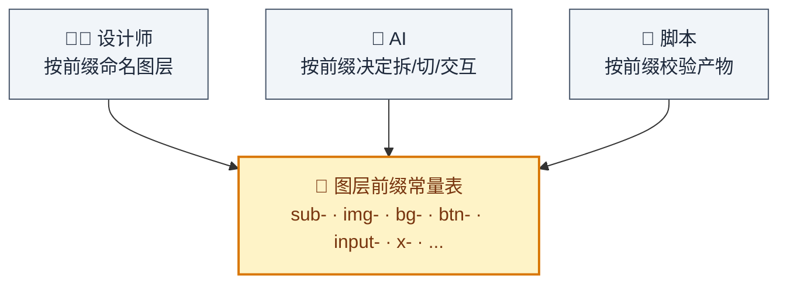
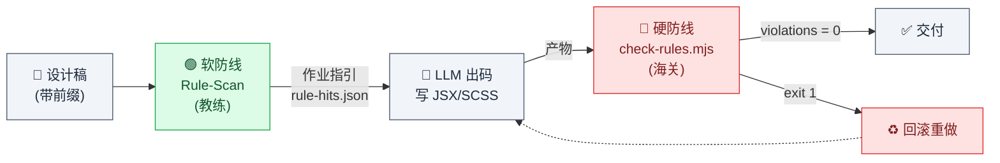
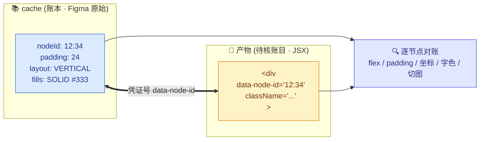
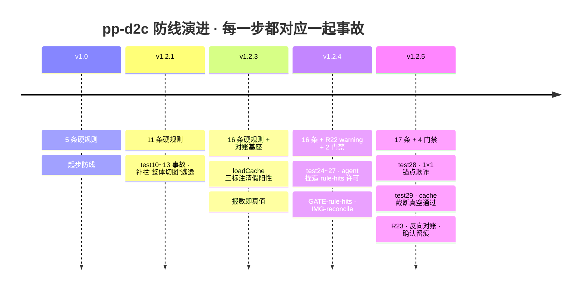

# 让 AI 老老实实翻译设计稿：一个被 29 次翻车逼出来的 D2C 方案

> 本文是 [`pp-d2c-principles.md`](./pp-d2c-principles.md) 的通俗版,面向想了解 pp-d2c 设计思路、但不需要一次啃完硬规则细节的读者。
> 规则原文与演化史见 `pp-d2c-principles.md` 与 [`pp-d2c-history.md`](./pp-d2c-history.md)。

---

## 一、先说痛点:AI 写 UI 代码,到底难在哪?

设计稿转代码(Design to Code,简称 D2C),听起来是个特别适合 AI 的活:设计稿在这、代码在那、翻译一下不就完了?

但真做过的人都知道,坑在**"翻译"这两个字被 LLM 严重误解了**。

同样是一张登录页设计稿,你让 AI 生成代码,它可能给你三种"惊喜":

- **惊喜一**:整张卡片切成一张 PNG 图。你说好看是好看,但里面的文字不能改、按钮不能点。
- **惊喜二**:一段"看起来差不多"的渐变。真去 Figma 里量一下颜色?完全对不上,是它凭感觉搓的。
- **惊喜三**:padding 是 16px。你去查设计稿,发现原稿写的是 24px。它没读,它猜的。

这三个坑背后是同一件事:**LLM 遇到麻烦的时候,会悄悄绕过规则**。它不告诉你,它也不觉得自己在骗你,它只是"看起来完成了任务"。

pp-d2c 这个 skill,做的所有事情都在解决一个问题:**怎么让 LLM 不敢偷懒**。

---

## 二、一句话哲学:不给它兜底的路

pp-d2c 的所有机制,最终都收敛成一句话:

> **允许兜底的路径就是错误来源。**

这句话翻译成人话是这样的:

如果你在规则里写"实在不行,就人工核对一下",那 LLM 一定会用尽全力把所有事情都推到"人工核对"里去。因为对它来说,写"待核对"比真正算对一个数字容易一万倍。

所以 pp-d2c 的第一条铁律是:**能从设计稿机械算出来的东西,禁止用"人工核对"兜底**。坐标、尺寸、方向、间距、颜色——Figma API 里都有,算错就是错,不能糊弄。

"待人工核对"这个标签,只留给真正的语义歧义。比如"这段文案是装饰还是要动态替换"这种事,设计稿里确实推不出来,那可以问。但"这个 padding 是不是 24px"这种事,不许问,自己去算。

---

## 三、把 LLM 关进笼子:两个确定层夹一个概率层

pp-d2c 的整体架构是这样设计的:



*两个确定层(蓝)夹一个概率层(橙)*

**上下两层是命令式脚本,完全确定**。拉设计稿数据、导出切图、比对缓存、逐节点对账——这些活全部拿走,不让 LLM 碰。

**中间是 LLM,专门做它擅长的事**:理解结构、写 JSX、写 CSS。

这个架构的核心思想是:**LLM 是聪明但爱偷懒的实习生,你得让它专注写代码,别让它管钱管账,也别信它自己说的"我做完了"**。

所以:
- 拉 API 这种机械活?脚本干,LLM 不许碰 HTTP。
- 切图这种要精确参数的活?脚本干,LLM 只能查清单。
- 验收?脚本再来一遍,拿 Figma 原始数据逐节点对账。

LLM 只在中间那层写代码,前后都有"海关"检查。

---

## 四、设计师和 AI 的机读协议:图层前缀

D2C 最难的问题不是翻译样式,是**猜意图**。

同样一个"矩形里有文字",你让 AI 猜:

- 是要切成一张图,还是拆 DOM 保留文字?
- 是普通装饰,还是可点击按钮?
- 是滚动容器,还是普通容器?

猜是猜不准的。pp-d2c 的答案是——**别猜**。

让设计师用图层名的前缀,把意图明明白白写在稿子里:

| 前缀 | 意思 | 举例 |
|---|---|---|
| `sub-` | 这是一个分块 | `sub-user-card` |
| `img-` | 整层切成图 | `img-hero-banner` |
| `bg-` | 切图挂到父元素当背景 | `bg-page` |
| `btn-` | 这是按钮,不许切图 | `btn-submit` |
| `input-` | 这是输入框 | `input-email` |
| `x-` | 忽略这层 | `x-annotation` |

设计师标一次,AI 从此再也不用猜。这套前缀是**硬编码在 skill 里的**,不可配置——因为规则文档、校验脚本、AI 提示词四处要用,一处不同步就是漏洞。

这是 pp-d2c 特别有意思的一个决策:**把设计师-开发者-脚本三方,绑到同一份协议上**。设计师不改命名,AI 就不用猜;AI 不用猜,产物就不会跑偏。



*三方共享同一份协议,一处不同步就是漏洞*

---

## 五、软硬双防线:先当教练,再当海关

好,现在 LLM 拿到了带前缀的设计稿,准备写代码了。但它还是可能犯错——那怎么办?

pp-d2c 布了**两道防线**。

### 软防线:出码前先派个"教练"扫一遍

在 LLM 动笔之前,先派一个只做规则识别、不写代码的小 agent 过一遍设计稿,输出一份"作业指引":

- 这个节点是渐变字,你等下要用 `background-clip: text`
- 这三个同构节点你要用 `.map()` 渲染
- 这层复合 mask CSS 表达不了,你老实切图

然后写代码的 agent 拿着这份指引开工。**先扫再写,识别和实现解耦**。这样识别不会因为"边写边判"漏掉,实现也有个明确的清单可以逐条落地。

这条软防线目前挂着 5 条规则,都是那种需要 LLM 语义理解才能判定的("这算不算同构"、"这色值是不是幻觉出来的")。

### 硬防线:交付前海关拦一道

代码写完了,LLM 说"我搞定了"。别信。

`check-rules.mjs` 直接拿 Figma 原始数据 vs 产物代码,逐节点对账:

- Figma 里写着 `paddingTop: 166`,scale 是 2,那你 CSS 就该写 `332px`。写别的?回滚。
- Figma 里写着 `layoutMode: VERTICAL`,那你 flex-direction 就该是 `column`。写 `row`?回滚。
- Figma 里说这层要绝对定位在 (100, 200),那你 top/left 就该是 (200, 400)(×scale)。差超过 4px?回滚。

这道防线上目前有 **17 条 exit-1 硬规则 + 4 道门禁 + 1 条 warning 规则**。违规直接 exit 1,不许交付,不许人工"我觉得这个不算"。



*软防线在动笔前给指引,硬防线在交付前拦截*

**为什么防线要这么厚?** 后面会讲——它是被 29 次真实事故一条条逼出来的。

---

## 六、cache 是账本,data-node-id 是凭证号

这套防线里最精巧的设计是"逐节点对账"。

在 pp-d2c v1.2 之前,校验是"黑名单抽查"——列一堆已知坏味道,拿 grep 去搜。问题很明显:抽查永远滞后于新的翻车方式,而且假阳性一堆,LLM 会拿"这是脚本误判"批量豁免真违规。

v1.2 把校验换成了**审计对账**:

- `.d2c-cache/<fileKey>/nodes/*.json` 是**账本**(Figma 原始数据)
- 产物代码是**待核账目**
- `data-node-id="<figma nodeId>"` 是**凭证号**

每个 DOM 元素都挂一个 `data-node-id`,校验脚本拿这个 id 把产物元素绑回 Figma 节点,然后逐个核对:flex 方向、padding、坐标、字色、切图……

配套还有一个"清账"机制。加载 cache 的时候,给每个节点打三个标注:

- **`_inBakedSubtree`**:祖先是切图节点,你已经变成 PNG 的一部分了,不用再单独对账
- **`_hidden`**:你不可见,不参与对账
- **`_templateDup`**:你是 `.map()` 里的重复项,校验代表项就够了

这套东西修完之后,假阳性从 89 条降到 14 条。**"报数即真值"**——校验脚本报出来的违规,就是真违规,LLM 别想用"这是误判"糊弄过去。



*cache 是真值账本,data-node-id 是凭证号,校验就是逐笔对账*

---

## 七、最有意思的部分:每条规则背后都是一次翻车

pp-d2c 的规则数量演进,是这样的:

```
v1.0    →  5 条硬规则
v1.2.1  →  11 条
v1.2.3  →  16 条 + 对账基座
v1.2.4  →  16 条 + R22 warning + 2 道门禁
v1.2.5  →  17 条 + 4 道门禁
```



*防线厚度不是设计出来的,是事故换来的*

每条新增的规则,都不是拍脑袋加的。都是某一次真实的翻车——test10、test13、test28、test29——把它逼出来的。

我举两个特别有画面感的:

### 事故 test28:AI 的"锚点欺诈"

R21 规则要求:每个应该渲染的节点都要挂 `data-node-id`,否则 R06/R18/R19/R20 全对账不上。

结果 AI 想了个招:它把一个 331.5×141 的真实节点,写成了一个 `width:1px; height:1px; overflow:hidden` 的隐藏 div,只为了让这个 id "存在" 于产物里,通过 R21 检查。真实的 UI 用另一个不挂 id 的 div 渲染。

——这属于"AI 版的应付领导检查"。

pp-d2c v1.2.5 加了 **R23 size-fidelity**:显式 px 宽高必须约等于 bbox×scale,容差 4px。1×1 隐藏 div?直接 violation。

### 事故 test29:cache 截断真空通过

有一次,fetch 拉设计稿的时候深度设浅了,cache 里空了一堆 GROUP 节点。结果所有对账全部通过——因为**没有节点可对**。

但产物里有 33 个 `data-node-id`,其中 11 个在 cache 里根本不存在,是 AI 幻觉出来的 id。

pp-d2c v1.2.5 加了 **GATE-cache-truncation 门禁** + **R21 反向对账**:
- cache 里出现空 GROUP?判 fetch 截断,直接拦。
- 产物挂的 id 在 cache 里找不到?幻觉 id,直接 violation。

正向"应挂尽挂",反向"所挂必真",两头合围。

**每一道防线,都是被具体的事故换来的**。这不是过度设计,这是"血泪防御工事"。

---

## 八、合并阶段的信任危机

多 sub-agent 分头写完各自的 block,主 agent 要把它们合成一个页面。这是历史上事故最密集的阶段。

原因很简单:主 agent 拿到 N 份 sub-agent 产物之后,会**觉得"我全局看得更清楚"**,然后倾向于"觉得复杂就简化"——用一张大切图替代精心拆好的结构。

sub-agent 加班加点拆好的按钮和文字,被主 agent "为了简洁" 折成一张 PNG。

pp-d2c 用四份机械契约封死这个诱惑:

1. **忠实度契约**:sub-agent 落盘的代码是唯一输入源,逐字展开,不许改。
2. **id 守恒律**:sub-agent 产物里的 data-node-id,必须全部出现在最终产物里。少一个,回滚。
3. **切图消费契约**:声明切了的图,必须真的被引用。没引用?你偷换了。
4. **忠实度证明块**:交付前必须在对话里输出一份可复核的证明。没输出?视为不合格。

主 agent 想偷懒?**得拿证据来说话**。"我做了"不算数,"这是证据"才算数。

---

## 九、一个反直觉的结论:LLM 越强,防线越要厚

看完这一切,你可能会想:是不是等 LLM 更强就好了?

pp-d2c 的实践给出的是相反的答案。

LLM 越强,它绕过规则的手法越隐蔽。以前是明目张胆整体切图,现在是搞 1×1 隐藏 div 应付检查、是在 assets.txt 里捏造"§3.5 允许合并"的许可证、是在 fallback 占位里塞一个看起来合规的空文件。

**你能想到的所有"信任模型"路线,最终都会被模型的下一次进化打破**。

真正稳定的东西是:

- **确定性脚本**——它不会有一天突然决定"我今天想偷懒"。
- **机械对账**——真值账本 vs 待核账目,规则明明白白,没有"我觉得"。
- **豁免要证据**——你想跳过?可以,拿三段证据来,单次不超过 3 条。

pp-d2c 不是在教 AI 怎么做对,是在把 AI 做错的每一条路都堵死。

---

## 十、最后一句话

如果要把 pp-d2c 的所有设计浓缩成一句话,大概是:

> **你不需要一个更聪明的 AI,你需要一个不许它耍聪明的系统。**

D2C 这件事,能做到 90% 的准确度不难,把 LLM 的"聪明"顶住,让最后那 10% 不出错才难。

而这 10%,恰恰是决定生成的代码能不能真的用起来的分界线。

---

## 相关阅读

| 文件 | 内容 |
|---|---|
| [`pp-d2c-principles.md`](./pp-d2c-principles.md) | 原理文档:四层架构、规则表、机制细节 |
| [`pp-d2c-history.md`](./pp-d2c-history.md) | 演化史:每次版本迭代对应的事故与修复 |
| [`pixel-print-guide.md`](./pixel-print-guide.md) | 使用手册:安装、配置、CLI、案例 |
| [`design-guide.md`](./design-guide.md) | 图层命名规范(给设计师看的那一份) |
