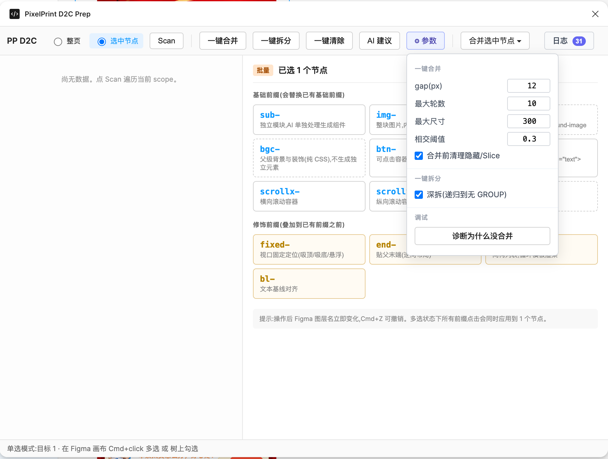

# 一键自动合并方案放弃复盘

> **状态**:放弃(2026-09-17)
> **作用域**:pp-d2c-prep-plugin 的"一键合并"能力(`plugin/src/analyzer/mergeIterative.ts`)
> **产物**:后续该算法**冻结**,不再迭代;UI 保留入口但降级为"辅助工具"或彻底移除
> **决策人**:lands
> **完整代码与探索过程**:见分支 [`tech/pp-d2c-prep-plugin`](https://github.com/double-coding-lab/PixelPrint/tree/tech/pp-d2c-prep-plugin) —— 包含 V1~V6 算法迭代、AI 建议接入、完整插件 UI 等所有产物,main 主线上只保留本复盘作为决策记录

## 1. 这次放弃不是"没开工",是**已落地后放弃**

写这份复盘时,以下能力已经**完整实现并在 Figma 里可用**:

- Scan(遍历图层树)
- **一键合并**(V1~V6 六轮算法迭代)
- 一键拆分(GROUP)
- 一键清除(隐藏节点 + Slice)
- AI 建议(接入大模型,产出打标 / 合并建议)
- ⚙ 参数面板(gap / 最大轮数 / 最大尺寸 / 相交阈值 / 深拆 / 诊断为什么没合)
- 合并选中节点、日志、诊断工具

所有按钮都真的能点,算法也真的会跑,AI 建议也真的会出。**是把整套 UI 都做完并接了真实稿子测过之后**,得出"这条路本身走不通"的结论 —— 不是产品经理拍脑袋放弃,不是"感觉不好做",是**做完看了产出、无法接受**。

---

## 2. 我们想解决的问题

在 Figma 插件里加一个"一键合并"按钮,把普通设计稿(散乱的 RECTANGLE / VECTOR / TEXT / GROUP …)**自动**按视觉逻辑打成能喂给 pp-d2c 的层级结构:

- 视觉上"贴在一起"的图形碎片 → 合成 `img-*` group(切图片)
- 视觉上"一整卡"的卡片 → 合成 `sub-*` group(子容器)
- 视觉上"一层大背景 + 上面一堆浮层" → 合成一个 group,BG 沉底、内容在上

**期望**:一键点完,不需要设计师逐层选中打组,减少 pp-d2c 前置准备的时间。

---

## 3. 我们试过什么(时间线)

| 迭代 | 核心思路 | 主要产物 | 失败模式 |
| --- | --- | --- | --- |
| **V1 — DSU 一次传染** | 同父兄弟按 `bboxGap ≤ gap` 建边,DSU 找连通分量,一个分量一次成组 | 阶段 A(图形)+ 阶段 B(混文字) | **跨卡冒进**:相邻卡片被拉进同一分量,变成一坨扁平合;或整簇超上限被丢弃,该合的也不合 |
| **V2 — Onion Merge(Mode A/B/C)** | 从最内层开始"洋葱式"合,遇到严格包含就外包一层 | 增加了严格包含判定 | **单元素套壳**:一个容器里只有一个元素时也建 group,下一轮再包一层……**10+ 层"分组"嵌套** |
| **V3 — 作用域 + 亲密度(pair 贪心)** | 用几何严格包含构建作用域森林,作用域内两两算亲密度、贪心挑最紧的对合成 pair | `buildScopeForest`+`mergeInScope`(两两 pair) | ①**pair 嵌套**:4 个相邻元素依次 (A,B)→G1,(C,D)→G2,(G1,G2)→G3,得到 3 层嵌套而非扁平;②**pair 后 bbox 膨胀传染**:C 本来离 A/B 30px 不合,pair 后 G1.bbox 蹭到 C 又合 |
| **V4 — 阶段 O anchor 一次性 N 元合 + 阶段 A/B 簇聚合** | 阶段 O 挑受众最多的 anchor,一次性把它 + 严格包含 / 显著相交的兄弟合;阶段 A/B 改成 DSU 分量一次性 N 元合 | `mergeInContainerByAnchor`+`mergeInScope`(簇合) | **自指无限套娃**:`figma.group([BG,A,B,C], parent)`→G,下一轮 visit(G),G.children 仍是 [BG,A,B,C],anchor 条件再次满足,又合一层……收敛失败 |
| **V5 — Broad gate(session 产物内部不合)** | 加 `if (sessionGroupIds.has(node.id)) return;` 硬闸门,session 合出的 group 内部不再触发合并 | 收敛了,但…… | **只合最外层**:大背景合完外层,内部的图 / 文子孙就再也进不了合并 —— 力度不够 |
| **V6 — 成员集签名去重** | 用 `sorted(id).join("|")` 记录已合成员集,同一批成员集拒绝再合;成员集不同可继续合 | `mergedSignatures` | 收敛但边界继续暴露新反例;截至放弃时,用户实际截图仍有"力度不够 / 冒进 / 混乱"问题 |

---

## 4. 为什么这条路走不通(根因分析)

放弃**不是**因为某一版代码写错了,而是**问题本身**具备下列结构性属性,决定了任何"纯几何 + 几何签名"的自动合并算法都很难同时满足设计师的期望。

### 4.1 视觉分组是**语义**问题,不是**几何**问题

设计师说"这几个东西是一组"依赖的是:

- **语义**:标题 + 内容 + 按钮 = 一张卡;背景装饰 vs 前景内容;主 CTA vs 辅助 CTA
- **上下文**:同一页里的其它卡是什么形态;这个模块在整个活动 / 详情页 / 列表里担任什么角色
- **意图**:设计师原本就想要什么层级(有的想要三张卡各成一组,有的想要三张卡合成一大 group 表示"卡组")

**bbox 的相交 / 包含 / gap 只能观测到"几何邻近"**。相同的几何邻近,在不同语境下可以是完全对立的合法结论:

- 大背景卡住三张卡 → 有时应合成一组(装饰底 + 内容),有时应各自独立(独立三张卡叠在同一层装饰上)
- 图 + 文本紧邻 → 有时是"图 + 图说"一体,有时是"背景图 + 上层浮标题"两回事
- 两张卡片间距 8px → 有时是一个 flex-row 单元,有时是两个独立单元

**没有任何几何阈值可以把这两种情况分开** —— 它们的 bbox 关系完全相同。

### 4.2 状态爆炸:边界情况数量 ≥ 我们能列举的规则数量

每种一次改动只解决一个反例,却打开一批新反例:

- 加"至少 3 成员"守卫:漏掉合理的 2 元合(比如"图标 + 标签")
- 加"pair bbox 不入池"守卫:防止膨胀传染,但阻断合法的"卡内 [标题,图]+[副标题] = 全卡"层级
- 加"session 产物内部不合"闸门:防套娃,但只合最外层
- 加"成员集签名去重":防自指套娃,但对同一批成员的**合理二次分组**也拒绝(比如先合成 img-*,后被 sub-* 吞入)

**"改一个反例、坏两个反例"** 的迭代节奏说明:我们在做的不是**修 bug**,而是**在用一堆几何启发式去逼近一个语义问题** —— 后者的解空间远大于前者。

### 4.3 收敛与"合到位"是天然对立目标

- 想合得深、合得多 → 允许 session 产物内部继续合并 → 触发自指套娃 → 不收敛
- 保证收敛 → session 产物内部不再合 / 同成员集不再合 → 只合最外层 / 拒绝合法二次分组
- 两者中间的"精细窗口" 需要区分"这次合成的这个 group 是最终产物 / 中间产物" —— **这个区分本身还是语义**

任何加"迭代次数上限"、"深度上限"的做法只是**掩盖**了矛盾:达到上限就停,输出的东西介于"没合完"和"合过头"之间,用户不会满意。

### 4.4 z-order + 视觉包含的方向性歧义

设计师的 z-order 表达了**意图**:

- 大背景放在图层顶部当"浮标遮罩"(z 最高)
- 大背景放在图层底部当"装饰底"(z 最低)

两者 bbox 完全一样。算法只看 bbox 时,"是合还是不合、合完 BG 该沉底还是浮顶"完全没有确定答案。我们做过 `preserveOriginalZOrder` + `moveGroupToBottomMemberPosition` 尝试保住原序,但那只是**保留**了设计师的意图,不能**利用**它做分组决策。

### 4.5 postorder + 就地修改画布 → 迭代过程不稳定

`walkOnce` 一边遍历一边 `figma.group()` 修改 children 数组,同一轮内合出来的新 group 会立刻成为父层的新候选。for round 迭代下一轮 visit 同一 parent 时,parent.children 已经变形(BG + 3 卡 → G1),新一轮的 candidates 和上一轮完全不同,anchor / 簇结论也不同 —— **算法在被自己修改过的画布上再判断**,行为难以预测,也难以在文档 / 单测里穷举。

### 4.6 用户反馈周期长、验收标准隐式

- 每一版算法都要**打包 → Figma 里 Close → 重新 Run → 对着真实稿子看结果**,单次验证 1-2 分钟
- "合得好不好"没有客观指标,只有**用户目视**;每次的反例都是新截图 —— 没有回归集
- 结果是**"改到没有反例"没有终点**;我们不知道离终点还有多远

### 4.7 实拍反例:一键合并后**首屏被吞、元素隐藏**

不是理论问题,是真实产出。以某营销活动二期稿(下方"火车 免单 / 20 元 / 8 元 / 6 元立减 …")为例:

- **合并前**:首屏(顶部"一杯好茶 快乐启程"红色主视觉横条)与下方九宫格、券包、出行神器等模块是**独立层级**
- **一键合并后**:算法把首屏主视觉横条也拉进大合并里(它和下方模块 bbox 相邻 / 部分相交),导致:
  - 首屏那块**被吞进外层 group**,视觉上被下方元素**遮挡**
  - 图层层级发生**用户不预期的重排**
  - **合并方式本身也不合理** —— 首屏是完整独立单元,不应该和券包区拉一起
- 具体表现:用户手写标注"**图层合并方式不合理并且会导致元素隐藏**"

**这个反例覆盖了 §4 的多条根因**:

- §4.1 语义:首屏 vs 券包在几何上"相邻",在语义上是**完全独立的两个模块** —— 算法只看几何做不出来这个判断
- §4.4 z-order:首屏被合进外层 group 后,z 层级从"顶层独立"降为"外层 group 的一个 child",视觉丢失
- §4.5 迭代不稳定:算法在被自己修改过的画布上再判断,导致外层合并把不该拉的元素也吸进来

**这不是靠调 gap / 相交阈值就能修的** —— 无论阈值调多严,总能构造一个反例;总能有一个"几何上刚好越过阈值,语义上不该合"的稿子。

---

## 5. 为什么不是"再多一版就行"

有人可能会说:"再加一条规则就好了。"我们不接受这个方向,理由:

1. **规则数量单调递增**:V1→V6 六次迭代,规则数量从 3 条(gap / clusterSize / maxItemSize)涨到 10+(overlapThreshold / containmentThreshold / anchor 阈值 / signatures / broad gate / postorder / ……),每加一条**都是**为了修一个反例。
2. **规则彼此耦合**:改一条阈值影响另一条判定;阶段 O 的 anchor 逻辑和阶段 A/B 的 DSU 逻辑不完全同源,却共享同一份 sessionGroupIds / mergedSignatures。**代码维护成本 > 用户价值**。
3. **没有客观验收**:即使我们把规则加到 30 条,只要设计师截一张新反例来,我们没有"这版可以合并 / 不可以合并"的客观依据反驳。
4. **无法回归**:没有测试集,今天修好的场景明天可能被下一条规则破坏,只能靠打开 Figma 目视。

**归根到底,几何启发式是一个"渐近线"** —— 无论加多少规则,总在设计师的**语义直觉**下方一段距离,而且距离不会因为规则变多而单调收敛。

---

## 6. 结论

**放弃"一键自动合并"能力**。

具体处置:

1. `plugin/src/analyzer/mergeIterative.ts` **冻结**(不再迭代);代码保留在仓库里作为历史。
2. UI 的"一键合并"入口:
   - **选项 A(推荐)**:彻底移除,减少设计师误操作和错误预期
   - **选项 B(保守)**:改名为"辅助:图形碎片粘合",只保留阶段 A(纯图形叶子 + gap),关闭阶段 O 和阶段 B,声明"只处理明显的图形碎片,其它请手动打组"
3. **保留能确定性工作的能力**:
   - 一键清除(隐藏 / Slice)
   - 一键拆分(只拆 GROUP)
   - 打标 / 前缀相关能力(sub- / img- / bg- / bgc- / x- / fixed- 等)
   - 诊断能力(诊断为什么没合)—— 转为**辅助手动打组**的工具:告诉用户"这两个从几何看是相邻 / 包含 / 相交",让用户自己决定要不要合
4. **不再重启同类项目**,除非未来出现下列**质变**信号:
   - 有稳定可用的多模态视觉理解模型(能看图直接输出分组意图)
   - 有明确的、可回归的验收集(至少 20 张典型稿 + 期望分组结果)
   - 设计规范能给出**结构化的**分组语义线索(比如强制约定"卡片必须用 auto-layout"、"背景必须锁定 + 命名前缀")

---

## 7. 沉淀出来的**可复用**副产物

即使主任务放弃,以下工程零件是有效的,可以留给后续 pp-d2c 相关能力用:

| 副产物 | 位置 | 备注 |
| --- | --- | --- |
| `bboxOverlapRatio` / `bboxGap` / `isContainedIn` | `mergeIterative.ts` | 几何工具,可用于诊断 / 视觉相邻查询 |
| `preserveOriginalZOrder` / `moveGroupToBottomMemberPosition` | `mergeIterative.ts` | **手动**合并 group 时保住 z-order 的正确姿势;merger 侧可能复用 |
| `deleteHiddenNodes` / `ungroupNodes` / `slice` 清理 | `analyzer/` | 独立、可确定性工作,继续保留 |
| `diagnoseMerge` | `analyzer/diagnoseMerge.ts` | 转"辅助工具":给两个节点报告几何关系 |
| 消息协议(rootIds 支持) | `types.ts` + `code.ts` | 选中节点范围操作的模式,后续能力可复用 |

---

## 8. 给后来者的一句话总结

> 用几何启发式做视觉自动分组,单看每一步都成立,合到一起是**渐近线** —— 会无限逼近设计师的直觉,但永远差最后一段。如果你要再做这件事,先想清楚你有没有**语义信号**(强设计规范 / 视觉模型),没有就别开始。

