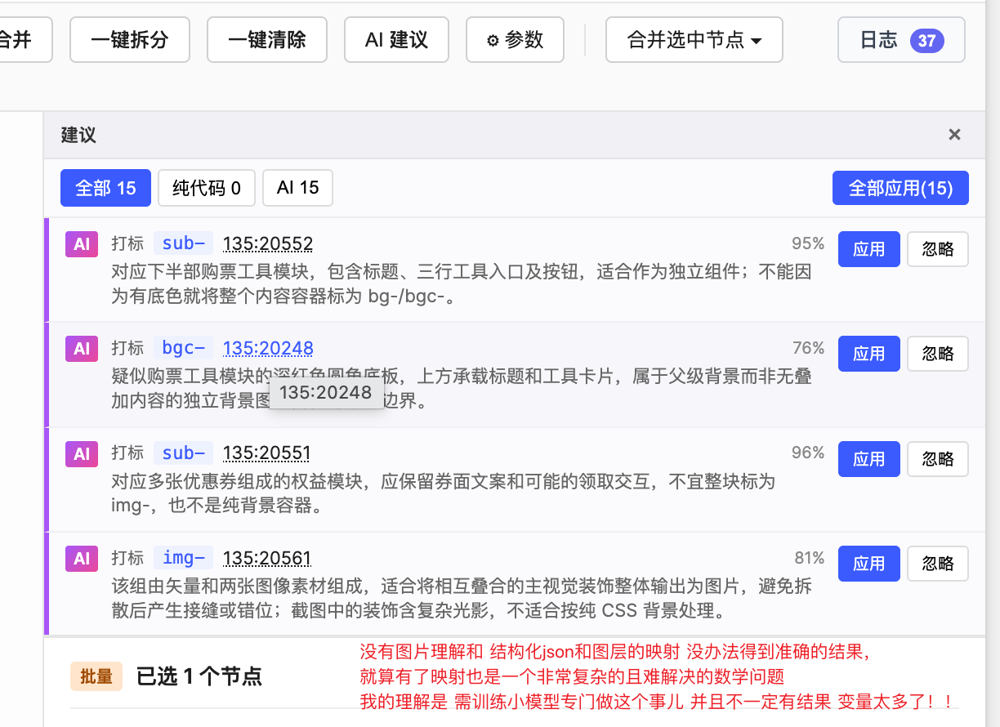

# 自动化标注与自动化布局 不可行论证

> **状态**:决策落定(2026-09-17)—— 不做
> **作用域**:pp-d2c 前置准备阶段的两条"自动化"设想
> ① **自动化标注 / 打标签**(把稿子里的元素自动识别为图片 / 输入框 / 同构列表 / 文字 …)
> ② **自动化布局**(把绝对定位的稿子自动改造为 Figma auto-layout)
> **姊妹文档**:见同目录 [`自动化分组_放弃复盘.md`](./自动化分组_放弃复盘.md)(自动化分组的实践复盘,是本文的直接反例来源)
> **决策人**:lands
> **完整代码与探索过程**:见分支 [`tech/pp-d2c-prep-plugin`](https://github.com/double-coding-lab/PixelPrint/tree/tech/pp-d2c-prep-plugin) —— 包含 AI 建议接入、结构化 JSON 打包 + node id 映射尝试、AI 建议 UI 面板等所有产物,main 主线上只保留本复盘作为决策记录

---

## 1. 结论前置

**这两条路都不做**,理由不是"技术上没跑通",而是**投入产出比根本不成立**,并且**"稿子是设计师画的、需求是产品定的、切图规则是开发定的"** 这个客观流程决定了任何"只看稿子"的自动化都无法产出正确结论。

**我们已经实际验证过两条路,不是纸上谈兵**:

- **规则算法**:接入了"有文字 / 无文字"、"相交 / 包含 / 相邻 + 亲密度"等启发式(见姊妹文档《自动化分组_放弃复盘》V1~V6),UI 里的"一键合并"按钮已完整落地,可在 Figma 里点开跑
- **大模型 AI**:接入了 LLM 做自动标注,插件里"AI 建议"面板已完整实现 —— 能拿到结构化 JSON 输入、调远端模型、按 node id 输出打标 / 合并建议、带置信度、支持"应用 / 全部应用 / 忽略"

**两条路都撞到同一堵墙**。这份文档给出的每一条论证,都能对应到我们插件里已跑过的**真实产出**。细节见下。

---

## 2. 为什么不做"自动化标注 / 打标签"

### 2.1 核心命题:**标注本身不花时间**

设计师在分组 / 拉自动布局的时候**顺手**就能完成标注(在图层名前加 `img-` / `sub-` / `x-` 等前缀)。这个动作:

- 一次点选 + 键盘输入一个前缀,秒级
- 和"设计师本来就在整理图层"的动作**同轨**,不产生新的心智负担

**开发一套自动标注系统去替代"顺手事"** —— 从成本角度就已经不成立:

| 项 | 手动标注 | 自动标注(算法 / AI) |
| --- | --- | --- |
| 单次准备时间 | 秒级 | 从有想法到能用,人月级投入 |
| 稳定性 | 100% 符合设计师意图 | 算法侧有边界情况,AI 侧有幻觉 |
| 错的成本 | 无 | 错一个标注,下游 D2C 生成结果崩,反查耗时 > 手动标注时间 |
| 维护成本 | 无 | 需求 / 设计规范变一次,规则表 / prompt 就要跟着改 |

**开发这样一个能力,ROI 本来就是负的。**

### 2.2 根本阻塞:标注是**三方共识**的产物,不是"看稿子能推出来的"

一张稿子上的元素**是不是图片、是不是可变、要不要做成组件**,由三方共同决定:

- **产品**:这个字段是不是要从接口取?这块面板是不是要支持后台配置?
- **设计师**:这个视觉块要不要跟视觉规范保持,是否允许换图?
- **开发**:这块的实现粒度是什么?列表还是循环还是硬编码?

**稿子本身只包含设计师的一次快照**,不包含产品需求和开发规范。举几个只看稿子无法判断的例子:

- 稿子上写"¥299" —— 这是硬编码文字还是从接口取的价格?**要看需求**。
- 稿子上一排三个卡片 —— 是同构列表(接口返回 N 条)还是三个独立模块?**要看需求**。
- 稿子上一个带背景色的圆角矩形 —— 是背景切图(`img-`)还是 CSS 背景(`bgc-`)?**要看开发的技术选择**。
- 稿子上有一个"输入昵称"字段 —— 是输入框(`input`)还是纯展示?**要看需求**是不是需要用户输入。

**要让 AI 正确标注,得把「产品需求 + 设计规范 + 开发规范 + 稿子」四路信息完整喂给 Agent**;这已经不是"打个标签"的任务,而是"从需求到实现的完整推理"。这个 Agent 的复杂度和交付难度,远超"设计师自己顺手打标"。

### 2.3 算法路更是无稽之谈

有人会问:那我不用 AI,用规则算法呢?比如"没有文字的分组一律标为图"?

这条路我们实际验证过(见 `mergeIterative.ts` 里 `IMAGE_LEAF_TYPES` + `hasSettledPrefix` 相关逻辑),得到的结论:

- 能把"没文字的图层组"和"有文字的图层组"分开 —— **仅此而已**
- **无法确定切图粒度**:一个"卡片"里有一张背景图 + 一个小图标 + 一段文字。是切一张大图(整卡背景 + 图标一起)?切两张(背景 + 图标各切)?还是三张(图标单独切 + 背景切两半)?**规则不能回答**。开发规范才能回答:如果背景要做动画就得独立切,如果不做就合成一张更好。
- **无法处理"文字要不要一起切进图"**:很多情况下,标题的花体字、艺术字、带描边阴影的文字,应当作为图片切进去,不引入字体;但另一些情况下,文字必须保留可变,以支持多语言 / 埋点 / A/B 实验。**规则不能回答**这个开发决策。
- **"切碎再拼装"的方案对 D2C 是负担**:如果不考虑开发整体性,把所有非文字都切成零碎小图 + 所有文字都用字体渲染,生成的组件会:
  - 组件树臃肿(切图数量爆炸)
  - 渲染性能差(小图零碎请求)
  - 无法复用设计视觉(艺术字用字体渲染必失真)
  - 后续维护成本高

**算法路解决了"最简单的一小部分",但最难的部分(切图粒度、切图边界、开发适配性)它一步都没解决**;而这些**才是真正花时间的部分**。所以算法版自动标注不但没有取代手动标注,反而**增加了错标之后设计师返工核查的时间**,是负收益。

### 2.4 AI 路我们也**实际接入了**,依然不行

除了规则算法,我们**接入了大模型**做自动标注实验。结论比预期更差,原因不在模型能力,而在**输入侧的信息形态**。

**关键约束:AI 只能吃 JSON,吃不了图像**

- 插件从 Figma 拿到的是**结构化 JSON**(children、type、x/y/w/h、fills、strokes、text 内容、name …);要给 AI 的也就是这坨 JSON
- **就算把画布截图一并塞给 AI 也无意义**:AI 看到的截图和 JSON 是**两套坐标系里的两份数据**,它无法可靠地把「截图里那块红色矩形」对应到「JSON 里的 `node_xxx`」—— 它没有指针,只有猜
- 结果:模型看图能"感觉"哪块是图哪块是文,但**无法把结论落到具体的 node id 上**;而标注的核心动作就是"给某个具体 node 加 `img-` 前缀",没有 node id 对应,一切结论都是空谈

**要让 AI 能干活,必须做一一映射**

理论上可以给 AI 塞:

- JSON 结构(以 node id 为主键)
- 画布截图
- **每个 node 单独的样式渲染 / 缩略图 / bbox 高亮图,和 node id 一一对应**

**核心成本正在于第三条**。要给 AI 建立"哪块视觉对应哪个 node id"的可靠映射,得逐 node 出图、逐 node 打 mask、把 mask + node id + 上下文一起编码进 prompt。这已经不是"调用一次 GPT" 的规模,而是**一套多模态对齐 pipeline** —— 而且做完之后:

- **仍然不解决语义问题**(需求 / 开发规范未接入,见 §2.2)
- **仍然要处理错标返工**(AI 错标一个,设计师核查一遍,时间没省下)
- **成本远超"设计师顺手打标"**

**换句话说**:AI 路的瓶颈不是模型智商,是**把稿子里"这块视觉是那个 node"这件事精确告诉 AI 本身就需要做大量工程** —— 而这件事**做完之后模型还是解决不了根本语义问题**。等于花大成本堆基建,产出仍然是负 ROI。

**实拍产出示例**(我们真跑出来的 AI 建议,不是理论推演):

同一张营销活动稿,AI 建议面板输出示例(节选):

- `打标 sub-  135:20241  78%` —— "该 frame 包含程/火/AI/旅/行/官两层文字,是内容组合而非背景,不宜标为 bg- 或 bgc-;如需保留,应作为独立标识组件。**截图中未能明确定位,需确认其可见性**"
- `打标 sub-  135:20567  86%` —— "该组包含促销说明、券包文案及矩形承托层,适合作为保留可编辑文字的促销信息组件..."
- `合并 img-  4 个节点  73%` —— "截图中的车窗、人物、饮品礼盒与飘带等构成相互遮挡的连续主视觉..."
- `打标 sub-  135:20552  95%` —— "对应下半部购票工具模块..."
- `打标 bgc-  135:20248  76%` —— "疑似购票工具模块的深红色圆角底板..."
- `打标 img-  135:20561  81%` —— "该组由矢量和两张图像素材组成..."

置信度看起来体面(76~96%),但**里面藏着两个致命信号**:

1. **"截图中未能明确定位"** —— AI 自己承认它没法把 node id 对应到画布上,不过是根据 name / children 结构猜的;命中主要靠**运气好 + 节点名字起得规范**
2. **"疑似"**、**"适合作为"**、**"如需保留"** —— 每条描述都在**避免下定论**;越是靠谱的模型越会把这种"我不确定"暴露出来
3. **同一 node 的判断彼此冲突**:20241 建议标 sub-(78%),另一条却讨论"不宜标为 bg-/bgc-";模型自己在给自己打架

**用户手写在这张截图上的原始结论**(逐字保留):

> 没有图片理解和 结构化 json 和图层的映射 没办法得到准确的结果,就算有了映射也是一个非常复杂的且难解决的数学问题。我的理解是 需训练小模型专门做这个事儿 并且不一定有结果 变量太多了!!

**这段话就是本节论证的实测结论**:接了 GPT / Claude 级别的通用大模型下来,产出仍然是"高置信度的猜"—— 因为模型缺的不是智商,是**看不到具体 node ↔ 视觉的对应关系**,而这个映射问题本身是一个"变量太多、组合爆炸"的复杂工程,通用模型解不了,得训**专门的小模型**,而训了也不一定有结果。

### 2.5 就算勉强做出来,**核验负担 > 手动做**

即便前面所有障碍都被绕过,**产出的可信度不够高**这件事本身就足以杀死这条路。原因:

**只要设计师不能"完全相信"自动结果,就必须逐个核验**。而核验一份 AI / 算法产出的结果,比"从零手动打标"更累:

| 场景 | 手动打标 | AI / 算法自动打标 + 核验 |
| --- | --- | --- |
| 心智模型 | 一件事:**看到 → 打上** | 两件事:**AI 说的对不对 → 不对的话我该改成什么** |
| 操作路径 | 选中节点 → 加前缀 | 打开自动结果 → 逐个对照原稿 → 判断对错 → 找出错的那个 → 修正 |
| 遗漏成本 | 少打一个,自己容易发现(还没轮到它) | AI **漏标 / 错标**很难发现:整棵树都被"看起来打好了"的假象覆盖,漏标的节点混在"已标"里没有视觉信号 |
| 累积误差 | 无 —— 自己打的,自己心里有数 | 核验 100 个节点里错 5 个,得**全部**看完才知道是哪 5 个;错的 5 个还得再修一遍 |
| 心理负荷 | 主动、可预测 | **被动、警觉状态**;设计师要一直保持"这条对不对"的怀疑 —— 认知疲劳比机械操作重得多 |

**这是"辅助工具"的经典悖论**:

- **要能替代人**:准确率必须接近 100%,否则每一份产出都要人工核对,等于没帮上忙
- **准确率 100% 做不到**:因为核心问题是语义决策(见 §2.2),不是几何 / 结构任务
- **中间地带都是负收益**:准确率 80% 时,设计师花在"核对 + 修正"上的时间 > 手动打标的时间;准确率 95% 时,反而更危险 —— 设计师容易信任、放过错误,错误一路带到 D2C 生成端才爆

**类比**:一个 80 分的"自动会议纪要 AI",听起来很美好,但当你必须为 100% 准确性负责时,你还是要**逐字对照录音一遍** —— 这时用 AI 反而更慢,因为你要**同时**读 AI 结果 + 听录音,两倍认知负担。

**关键结论**:

- 自动标注 / 布局这类工具,**只有当准确率 = 100%** 才有意义(输入即输出、无需核验)
- 当准确率 < 100% 时,**核验负担就把节省的时间全部抵消,并进入负值区间**
- 而 100% 准确率的自动标注 / 布局工具,**当前技术做不出来**(见前 4 节论证)

### 2.6 一句话总结

**标注本身不花时间,替代它的自动化系统必须"完美"才有价值** —— 而"完美"要求:

- 需求 / 设计 / 开发 三方语义信息完整接入
- AI 侧还要构建 node ↔ 视觉的精确映射基建
- **准确率必须真的到 100%**,否则核验负担把节省的时间反向吃掉

当前技术做不到,也没必要做到。

---

## 3. 为什么不做"自动化布局(一键 auto-layout)"

### 3.1 命题:如果这件事能做,Figma 早就集成了

**auto-layout 是 Figma 官方能力**。Figma 内部有完整的 SDK、完整的渲染管线、完整的画布数据 —— 他们比任何插件都更适合做"一键 auto-layout"这件事。

事实是:**Figma 官方都没做**。他们做的是"手动挑选一批节点,你告诉我用什么方向,我帮你转 auto-layout" —— 依然需要设计师**逐层选中 + 手动指定方向**。

**如果这件事真能做到"一键完成",它一定被官方吃掉**。第三方插件即便真做出来一版,也没有护城河,官方一集成就归零。**所以哪怕成本上算得过来,战略上也不该做**。

### 3.2 技术上为什么"一键 auto-layout"极难

**方案 A — 纯 AI 看 JSON 决定 auto-layout 结构**

输入:一份带绝对定位的 Figma 图层 JSON(children 各自带 x/y/w/h、颜色、类型)。
输出:一份 auto-layout 结构 JSON(哪些是 `HORIZONTAL` 容器、哪些是 `VERTICAL`、哪个是间距、哪个是 padding …)。

**问题**:

- **视觉信息在 JSON 里被抹掉了**:两个矩形 x=100/x=200 是"两列布局"还是"卡片重叠"?两个 TEXT y 相邻是"标题+副标题一列"还是"两个独立单元并排偶然对齐"?**只靠 JSON 无法回答**。
- **auto-layout 转换会重排画布**:auto-layout 一旦启用,子元素的 x/y 由 layout 参数决定,不再由绝对定位决定 —— **只要参数选错一个,视觉就变形**。而"视觉是否变形" AI 光看 JSON 无法验证(它没看到画布)。
- 结果:**一定会造成视觉变化**,而且**不一定合理**。

**方案 B — 图层 + JSON 双路输入,AI 结合视觉推理**

输入:结构化 JSON + 画布截图(甚至逐帧调整反馈)。

**问题**:

- 这不是通用大模型跑 prompt 能解决的,**需要一个专门训练的、面向布局推理的小模型**
- 训练集在哪?需要"人工标注的 <稿子 → 正确 auto-layout 结构>"pair,规模至少数千级,还得覆盖各种设计流派
- 训练 + 推理 + 部署 + 迭代的团队成本 —— **这已经不是"给 pp-d2c 加个前置工具"的规模**
- 就算训好了,依然要面对上一节的 Figma 集成风险

**方案 C — 纯规则算法**

理论上可以尝试"从最内层开始,识别行 / 列排布,自底向上包 auto-layout frame"。**但这遇到和自动分组一模一样的困境**:

- 一个视觉块可能同时符合"是列表""是并排双列""是叠加浮层"多种规则
- **每条规则都有反例**,规则之间彼此耦合、无法通过增加规则数量收敛
- 见 §4 的自动分组教训

### 3.3 一句话总结

**"一键 auto-layout"是能力天花板本身很高的事**:如果做出来,Figma 会集成;如果做不出来,做的过程会重演我们在自动化分组上踩过的所有坑。**两头都不划算**。

### 3.4 补充:核验负担同样杀死"半自动 auto-layout"

即便技术上勉强产出一版半自动方案,§2.5 的核验悖论**同样成立**:

- **auto-layout 一旦生成错,视觉就变形**,而变形不像标注错那样一眼可见 —— 设计师必须**逐帧对比**"转换前 vs 转换后"才能确认没走样
- 逐帧对比几十个 frame 的成本 **> 手动一个一个拉 auto-layout**
- 而且 auto-layout 转换是**破坏性的**(x/y 由 layout 参数接管),错了不能像标注那样简单撤回一个前缀 —— 得整块重做

所以自动化布局的判定标准和自动化标注一致:**准确率 100% 才有意义**,任何低于 100% 的方案在实际工作流里都是负收益。

---

## 4. 佐证:自动化分组的实践教训(直接引用)

我们已经**实际落地**了一次自动化分组,通过"相交 → 包含 → 相邻"三层判定 + 亲密度打分的方式,让插件自动把稿子里的元素合成 group。结果:

- 对**做了初步结构分组的稿子**,能凑合工作
- 对**散乱的普通稿子**,**错误合并普遍存在**;错误合并的直接后果是**图层遮挡** —— 本该在上层的元素被压到 group 内部导致视觉丢失
- 定义了非常多的规则(严格包含、显著相交、bbox 邻近、锚点吸引、成员集签名去重……),但**一个元素块常常同时符合几种规则,算法根本无法通过结构本身断定应该用哪种**

**详细版见姊妹文档 [`自动化分组_放弃复盘.md`](./自动化分组_放弃复盘.md)**,其中记录了 V1~V6 六次算法迭代,以及"改一个反例、坏两个反例"的迭代节奏。

**这次教训是本文两个论证的直接证据**:

- 自动化**分组**(相对简单,只看几何)都跑不通
- 自动化**标注**(需要更多语义 + 需要给 AI 建立 node ↔ 视觉映射基建)、自动化**布局**(需要视觉验证)必然更跑不通

---

## 5. 处置

| 事项 | 处置 |
| --- | --- |
| 自动化标注功能 | **不做**。前缀 / 打标由设计师手动完成;插件保留"批量打标"辅助 UI(Quick Tag Panel),让设计师顺手多选、批量加前缀,而不是"一键 AI 帮你打" |
| 自动化布局功能 | **不做**。auto-layout 由设计师手动完成;若未来 Figma 官方推出一键能力,直接使用官方 |
| 自动化分组功能 | **已冻结**(见姊妹文档);UI 入口降级为"辅助工具"或彻底移除 |
| 未来是否重启 | **不重启**,除非出现下列质变: ① 有稳定、可用的多模态视觉理解模型(能看图直接推分组 / 布局意图);② 有明确、可回归的验收集(至少 20 张典型稿 + 期望结果);③ 设计规范给出**强结构化**的语义线索(比如强制约定"卡片必须 auto-layout"、"背景必须锁定 + 命名前缀") |

---

## 6. 保留下来的正确方向

不做上述三个"自动化"能力,不等于插件本身没意义。以下方向**是可以确定性工作的**,继续保留:

- **辅助手动打标**:Quick Tag Panel、右键批量前缀、诊断为什么某两个节点没合(把几何判定作为诊断工具而非决策工具)
- **确定性清理**:一键清除(隐藏 / Slice / 无用节点)、一键拆分(只拆 GROUP)—— **它们输入输出可确定、无歧义**
- **人工辅助合并**:选中若干节点 → 合成 group + 打前缀,这是 `merger` 侧能力,继续保留
- **规则 / 自检**:pp-d2c-rule-scan 类"给稿子体检"的能力(报告哪些没打标、哪些遮挡、哪些命名不合规),让设计师**知道自己漏了什么**,而不是替他决定怎么做

**共同点**:这些能力都遵守"**给设计师工具,不替设计师做决定**"的原则。

---

## 7. 给后来者的一句话

> "自动化标注 / 布局 / 分组"这类问题看似是几何 / 结构任务,**本质是全流程语义决策**:需求 → 设计 → 开发 三方共识才能得到唯一解。任何只看稿子的算法或 AI 都是在"信息缺失"下猜测 —— 我们**规则算法和大模型两条路都真跑过**,得到的都是同一堵墙。**手动本来就不花时间**,替代它的方案必须完美才有价值,原因不止是"做不到 100% 就没用",更是 **"做不到 100% 时,设计师的核验负担会比手动做更高"** —— 一个不能被完全信任的自动化工具是负资产,不是零资产。当前做不到,以后也不建议主动做。

