# 设计师自动布局设计规范

## 一、自动布局的作用

自动布局在**物理意义上描述了元素之间的关系**：谁在谁上面、间隔多少、贴着哪条边，都由布局设置表达，而不是靠肉眼摆坐标。

自动布局的本质是**给一个父元素设置**——设置之后，该元素内部就拥有了自动布局的特性，内部子元素按规则自动排列。

## 二、自动布局特性

选中一个 Frame 后，右侧面板的「自动布局」区域就是全部设置入口：流（布局方式）、调整大小（宽高）、对齐、间距、边距。

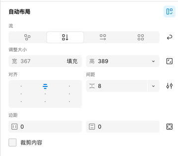

在图层面板里，**看图层名最前面的图标就能认出当前是什么布局**：

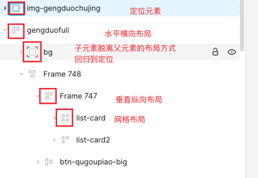

### 1. 自动布局方式

面板顶部的「流」共四种方式：**定位、垂直、水平、网格**。

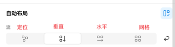

#### 1.1 定位布局

定位布局就是**非自动布局**：子元素可以用鼠标随意拖拽摆放，元素之间没有任何约束关系。

#### 1.2 垂直自动布局

子元素沿垂直方向依次排列。选中父框后，画布上可以直接看到并拖动两类间隔：

- **蓝色**：内边距（padding，容器边缘到内容的距离）
- **红色**：所有子元素之间的间距（gap）

鼠标点击到父框（如下图 Frame 739），即可拖动间距或内边距直接调整数值。水平自动布局同理，只是排列方向变为横向。

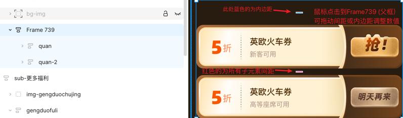

#### 1.3 网格布局

网格布局有独立的属性设置：设置网格的**横向数量或纵向数量**，子元素按行列自动填入；点击 **Open grid settings** 按钮，可以对单独的某一列 / 某一行设置宽高占比（如 1fr 等分）。

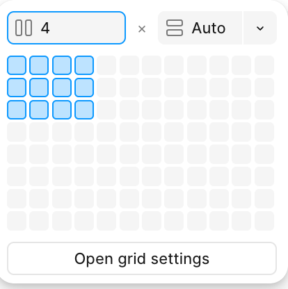 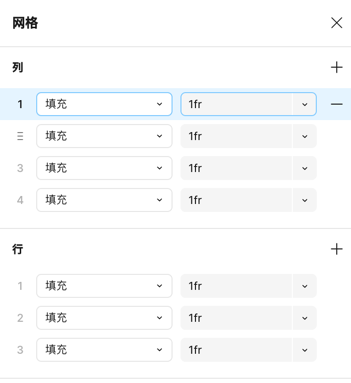

实际案例——优惠券卡片墙用网格布局，一个 `list-card` 容器管住所有卡片的行列与间距：

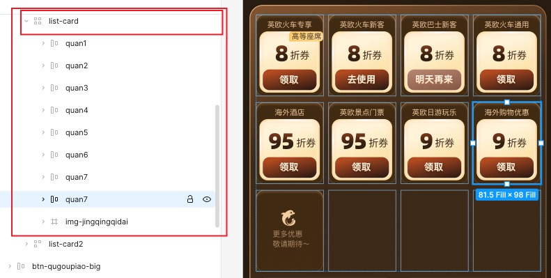

### 2. 自动布局属性介绍

#### 2.1 宽高

「调整大小」里的宽、高各有三种模式，点开下拉可选：

- **固定（Fixed）**：写死数值
- **适应内容**：由内部内容撑开
- **填充容器**：占满父容器的可用空间

还可以按需添加最小 / 最大宽高（Add min/max width、Add min/max height）。

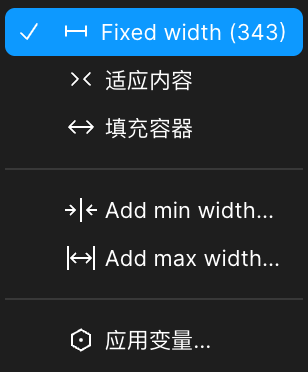 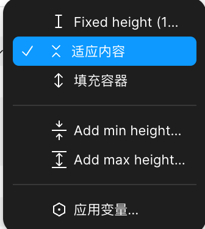

宽高输入框右侧的按钮可以**锁定宽高比**，调整一边时另一边等比变化：

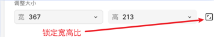

#### 2.2 对齐方式

对齐方式会**根据当前元素的自动布局方式变化**。下图是水平（横向）自动布局的对齐设置：

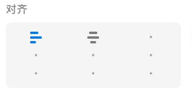

⚠️ **注意对齐和边距的关系**：如果点击了下部分的三个底部对齐方式，该元素的内部元素就会**从底部开始布局**，其他方向同理；并且排布会以**当前方向的 padding 内边距**为准。

#### 2.3 间距

图层上**红色**的为间距，代表该自动布局元素内部的**所有子元素**的间隔——是统一值，**不可以单独设置某一个间隔值**。

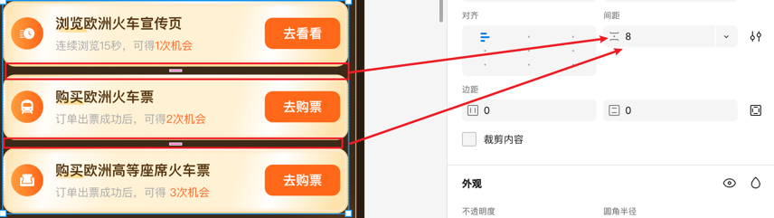

间距还可以直接设置为 **Auto（自动间距）**。设置后子元素会被均匀拉开、**铺满整个容器**——下图两个容器宽度一样，上方固定间距 9 时卡片靠左排列，下方自动间距时三张卡片铺满容器：

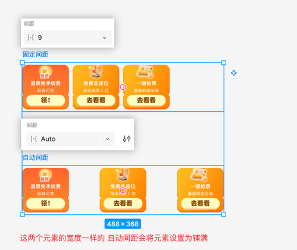

小技巧：**双击左侧的对齐方式可以快速把间距设置为 Auto**；间距等于 Auto 的时候，左侧对齐方式的图标样式也会随之改变。

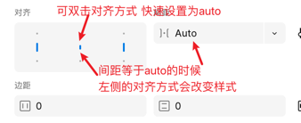

#### 2.4 内边距

所有的自动布局元素**四边都有内边距**，且**可以单独设置**每一边的值，在图层上表现为**蓝色**。

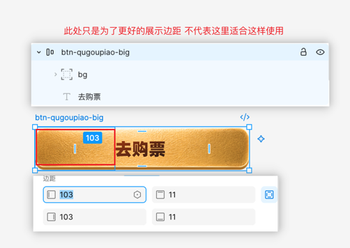

#### 2.5 裁剪内容

面板最后一项是**裁剪内容**。勾选后最直观的感受就是：**子元素中超出该元素宽高的部分会被隐藏掉**。

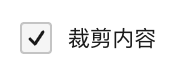

未勾选 vs 勾选的对比（同一个 `sub-baibaoxiang` 模块）：

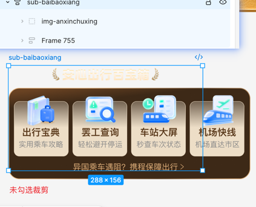 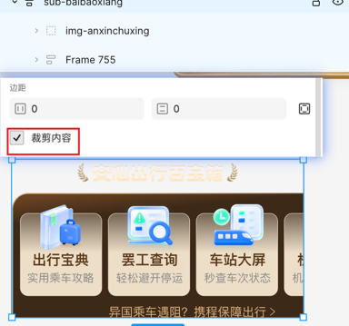

## 三、D2C 布局规范

### 1. 不要无脑自动布局

**有以下两个需求（之一）的时候，才设置自动布局**：

1. 对内部**多个子元素**有布局需求
2. 元素本身需要设置**内边距**或者**宽高适应**

**不设置自动布局的情况**：

1. 该元素内部**只有一个子元素**的时候——这样设置是无意义的，因为自动布局影响的是自身或者子元素。此时**需要取消这一层自动布局**，否则会对 D2C 生成的数值产生影响。

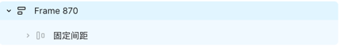

2. **打了 `img-` 和 `bg-` 前缀的图层**——不需要自动布局。打了这两个前缀之后，D2C 就不会解析内部结构，而是自动切图。

### 2. 将子元素脱离自动布局

当自动布局元素下的**某一个特殊子元素**需要脱离流式布局、改为定位布局的时候，可以点击「位置」版块**右上角的"脱离自动布局"按钮**。点击后这个图层就可以随便拖动了。

**最多的使用场景**：一个自动布局元素下的**背景图或者背景色**。下图采用对比法——右侧把 `bg` 隐藏后可以看到，`bg` 是脱离自动布局、垫在整个 `gengduofuli` 容器底下的背景层：

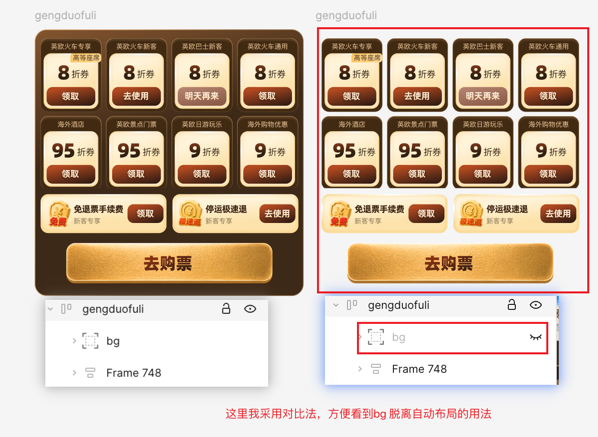

另一类场景：**全局定位元素**（如吸顶状态栏）也会脱离流式布局：

⚠️ **边界说明**：如果该元素的父元素**不是流式布局容器**，就没有"脱离自动布局"一说——因为它本身就是定位元素。**只有当当前元素的父容器是流式布局的时候，才需要脱离。**

### 3. 父元素的宽高包裹子元素

尽量做到**父元素的宽高包裹住子元素**，不要让子元素超出父元素的范围。

### 4. img 和 bg 不要混用

`img-` 前缀的元素和其他普通元素是一样的——一般存在于流式布局（自动布局）中，**是占位置的**。

只有 `bg-` 前缀是**脱离流式布局**的，**不占用父元素空间**。

补充：`bgc-`（背景色）有两种用法——可以和 `bg-` 一样**单独用一个图层**表示，也可以**直接在父元素上设置背景色**。

### 5. sub 前缀：要么 0 个，要么 2 个以上

一个稿子中的 `sub-` 前缀，**要么 0 个，要么 2 个以上**。

原因：`sub-` 前缀的 UI 会单独分配给另一个 AI 做，多个 sub 会**同步一起做**，能提高效率；但如果只有 1 个 sub，就没有任何收益，反而会更慢。

另外两条注意：

- **不要把一小块设置为 sub**（sub 应该是一个功能区块）
- **不要在 sub 内部嵌套 sub**

### 6. 切图规范

**不要把所有的元素都切到一个大背景上，然后让子元素去对齐**——这样很容易导致样式偏离。

简单说：**有相对位置关系的元素，要么作为 img、要么作为 text，融入到流式布局和子元素内部**。不要简单地切图，然后拼接像素。

下图对比了几种切法（红字标注）：第 2、3 种都不建议——"官方…"说明文字应该单独作为一个图层，年月日的背景应该单独切图；第 4 种可以。因为第 2、3 种会让其他元素插空对齐，而按第 4 种方式，内部几个元素的相对位置就是正确的——就算有问题也是整体有问题：

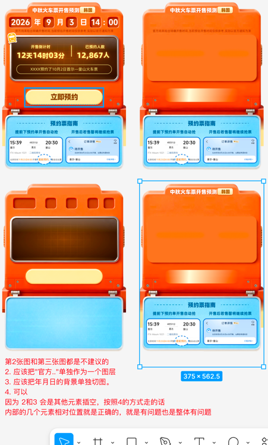

### 7. 不等间距的处理

如果一个元素下有三个子元素 A、B、C，其中 **A 与 B 的间距是 10，B 与 C 的间距是 20**（间距不统一，一个 gap 值表达不了），有以下三种办法处理：

**方式 1：分组**。先把 A、B 创建一个自动布局、间距设为 10，得到 AB 组；AB 组再和 C 创建自动布局、间距设为 20。

**方式 2：空元素占位**。在 B 和 C 之间创建一个空元素（高度为差值），容器间距仍用统一值。

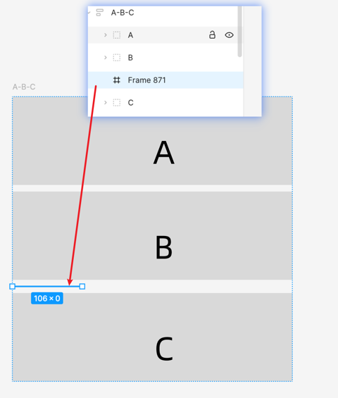

**方式 3：套一层加 padding**。对 C 这个单个元素**单独再做一层自动布局**，利用这层自动布局的顶部 padding 补出多出来的间距。

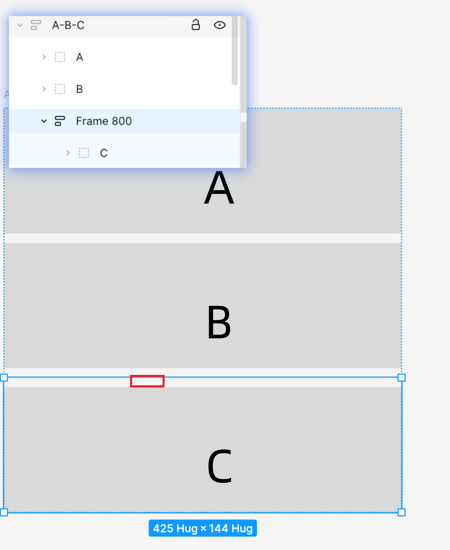

⚠️ **注意：不要直接在 C 上设置 padding，是没有用的**——因为我们要的是 **C 整体下移**，而不是 C 内部的内容下移。

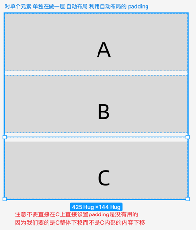

### 8. 文字尽量用"填充容器"

**尽量多对文字使用"填充容器"，不要对文字使用恰恰好的固定宽度。**

如果使用固定宽度，D2C 生成的代码也会是固定宽度——运行时文字一长，就会打乱布局。

下图对比：错误示例里子元素文字是恰好的固定宽度；正确示例里子元素用了"填充容器"，自然占满父元素剩下的宽度，文字变长也不会乱：

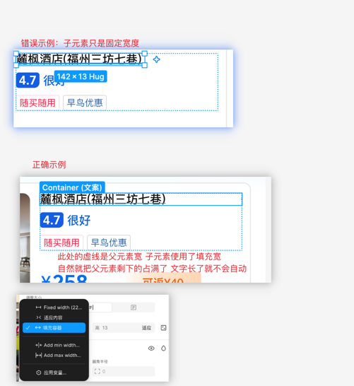

### 9. 学会使用对齐方式

学会对元素使用**对齐方式**，特别是**底部对齐、居中对齐和右侧对齐**等。

例如：底部弹窗就应该使用**底部对齐**，而不是"顶部对齐后再设置 padding 把它推下去"。

### 10. 多样式种类的列表：把单个样式单独列一排在旁边

如果一个列表中有**非常多的样式种类**，但外层宽高是固定的、不同的实验环境是不同的组合——就可以**把所有的单个样式单独列一排放在旁边**，方便 D2C 和代码生成：

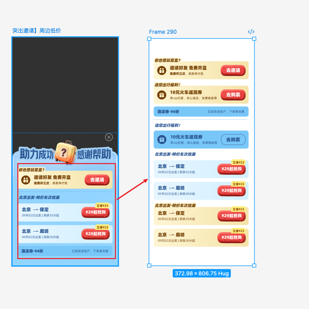

## 四、操作技巧

1. 常用快捷键：

| 快捷键 | 作用 |
| --- | --- |
| `Shift + A` | 设置为自动布局 |
| `Shift + Option + A` | 移除自动布局 |
| `Command + G` | 分组 |
| `Command + Shift + G` | 取消分组 |

💡 **小提示**：可以选择多个元素直接 `Shift + A` 一步建自动布局——但这种情况有可能会把一些形状元素整合进去，导致结果不符合要求。此时可以改成**先 `Command + G` 合并分组，再对分组设置自动布局**。
