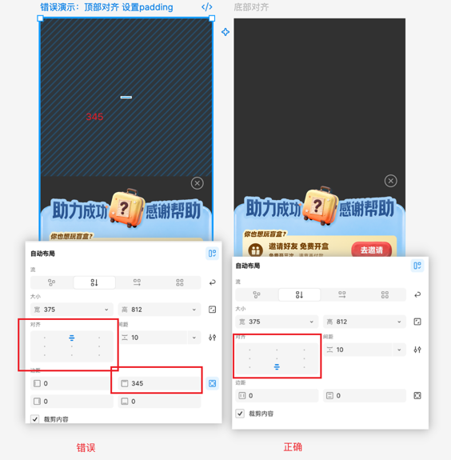
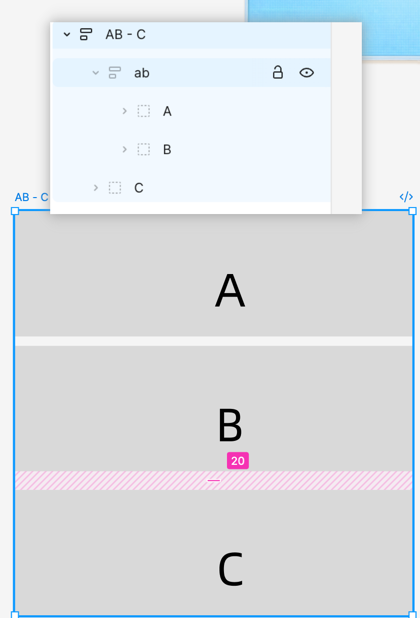
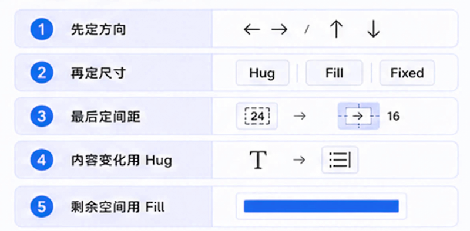
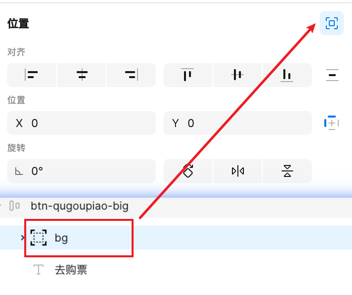
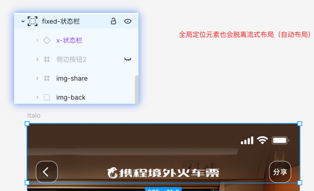

# 2\. 自动布局设计规范

### 使用场景：

按需使用自动布局，避免无实际作用的容器嵌套，保持图层结构简洁，减少对 D2C 解析结果的干扰。

|**需要使用自动布局的情况**|**无需使用自动布局的情况**|
|---|---|
|- **多个子元素需要统一排列**：需要控制排列方向、对齐方式或元素间距。 - **容器需要内边距或尺寸自适应**：需要设置内容与容器边界的间距，或使容器宽高随内容、可用空间调整。|- **仅包含一个子元素，且无额外布局需求** 当容器内只有一个子元素，且不承担内边距、对齐或尺寸自适应等作用时，应取消该层自动布局；若容器本身也无实际用途，可一并移除。 \*例1：按钮只包含文字一个子元素，但有内边距布局，所以需要自动布局； \*例2：该Frame 870 内只有一个子元素,为无效自动布局。   - **使用 ****`img-`**** 或 ****`bg-`**** 前缀的切图图层** 按当前 D2C 约定，此类图层会作为整体切图处理，不再解析内部结构，因此无需为 D2C 额外设置内部自动布局。 若已有自动布局用于设计编辑或内容适配，可按实际需要保留。|

### 布局逻辑：决定好布局逻辑，再按shift\+A

#### 先定规则，再放内容（定方向、定尺寸、定间距）

##### （1）动手前先判断以下3个内容：

##### （2）浮窗场景\-优先底部对齐：

例如：底部浮窗就应该使用**底部对齐**，而不是"顶部对齐后再设置 padding 把它推下去"。

正确\(直接底部对齐\)

错误\(顶部对齐\+345 padding 推下去\)

#### 父子关系：先分清谁控制谁

##### **（1）父级定规则，子级定内容**

##### （2）复杂背景切图，不要作为唯一父级

**不要把所有的元素都切到一个大背景上，然后让子元素去对齐**——这样很容易导致样式偏离。

简单说：**有相对位置关系的元素，要么作为 img、要么作为 text，融入到流式布局和子元素内部**。不要简单地切图，然后拼接像素。

下图对比了几种切法（红字标注）：第 2、3 种都不建议——"官方…"说明文字应该单独作为一个图层，年月日的背景应该单独切图；第 4 种可以。因为第 2、3 种会让其他元素插空对齐，而按第 4 种方式，内部几个元素的相对位置就是正确的——就算有问题也是整体有问题：

### 间距：

#### 建立明确的间距规则

拒绝空白像素撑距离，可以用蒙层约束

#### 不规则间距，优先使用多层嵌套

|**优先级**|**做法**|**适用条件**|**示例**|
|---|---|---|---|
|1|按内容关系多层嵌套|同间距元素建立子编组，不同间距元素外层 嵌套一层||
|2|空元素占位|仅在前两种无法表达时使用，并计算相邻 Gap||

### 文本与按钮：

#### Fill：宽度占满剩余空间（常用场景）

#### Hug：按钮宽度跟着内容变

自适应内容变动：内容多长，组件就多宽

#### 不知道怎么选？按照这个判断：

### 脱离自动布局：怎么用？什么时候用？

当自动布局元素下的**某一个特殊子元素**需要脱离流式布局、改为定位布局的时候，可以点击「位置」版块**右上角的"脱离自动布局"按钮**。点击后这个图层就可以随便拖动了。

#### 背景图（常见场景）

一个自动布局元素下的**背景图或者背景色**。下图采用对比法——右侧把 `bg` 隐藏后可以看到，`bg` 是脱离自动布局、垫在整个 `gengduofuli` 容器底下的背景层：

#### **全局定位元素**（吸顶状态栏）：

设计稿中状态栏常作为预览效果

⚠️ **边界说明**：如果该元素的父元素**不是流式布局容器**，就没有"脱离自动布局"一说——因为它本身就是定位元素。**只有当当前元素的父容器是流式布局的时候，才需要脱离。**

### 多状态画板：建立多状态单独画板

如果一个列表中有**非常多的样式种类**，但外层宽高是固定的、不同的实验环境是不同的组合——就可以**把所有的单个样式单独列一排放在旁边**，方便 D2C 和代码生成：

### 操作技巧小tips：

|常用快捷键|作用|
|---|---|
|`Shift + A`|设置为自动布局|
|`Shift + Option + A`|移除自动布局|
|`Command + G`|分组|
|`Command + Shift + G`|取消分组|

💡 **小提示**：可以选择多个元素直接 `Shift + A` 一步建自动布局——但这种情况有可能会把一些形状元素整合进去，导致结果不符合要求。此时可以改成**先 ****`Command + G`**** 合并分组，再对分组设置自动布局**。

💡 **最后的提示**：**并不是所有元素都需要自动布局**——自己根据经验找一下度。该用的地方用足（多子元素、需要内边距 / 宽高适应的容器），不需要的地方果断不用（单子元素容器、`img-` / `bg-` 内部等，见「三、D2C 布局规范」第 1 条）。

